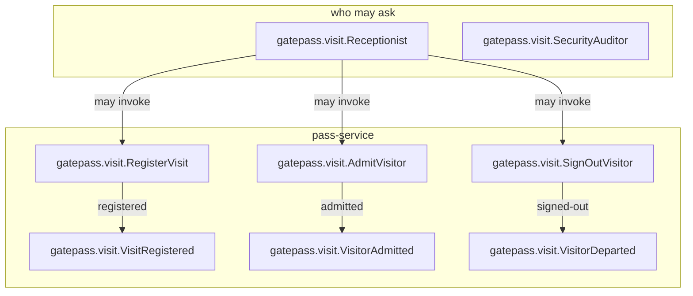

<!--
generated from gatepass v1
model digest f2e0f8ff51c077fa1c713d8151544379bafac36a5a927e71c685042d53ab6e61
contract digest e6e58e055d24f8f494dcff274f55e723d967f9d1f9aea16641bb8dacbb71171e
do not edit: regenerate with `ess generate`
-->

# gatepass v1

Visitor passes for a building: who is expected, who is inside, and who has left. Three commands, two of which can be refused for two different reasons, one lifecycle, two projections and no binding — because the one transport this system has is the one its component's own words require, and nothing here reacts to an event.

## The system as a graph

A command is accepted by the component that owns its context, emits the events one of its outcomes declares, and a dashed edge is a binding carrying an event into the next command. Design §9 begins one step earlier, at the actor who invokes the first command, and so does this graph: a solid edge out of an actor is a grant, and an actor drawn with no edge at all may invoke nothing — which is something the model says, not an arrow somebody forgot.

## Bounded contexts

- **[Visits](domains/gatepass-visit.md)** (`gatepass.visit`) — Expecting a visitor, letting them in, and letting them out again. Eight types, one entity, two views, three commands, three events, two errors and two actors.

## Components

A component is a unit of ownership, not a deployment. How many of each runs, and what each needs, is [the topology](topology.md).

**`pass-service`** — Holds every expected, present and departed visit for one site. It owns [`gatepass.visit`](domains/gatepass-visit.md). It accepts `gatepass.visit.AdmitVisitor`, `gatepass.visit.RegisterVisit` and `gatepass.visit.SignOutVisitor`. It publishes `gatepass.visit.VisitRegistered`, `gatepass.visit.VisitorAdmitted` and `gatepass.visit.VisitorDeparted`.

## The other pages

| page | what is on it |
|---|---|
| [Visits](domains/gatepass-visit.md) | the `gatepass.visit` vocabulary: its types, entities, views, commands, events, errors and actors |
| [Interactions](interactions.md) | every binding, with what it guarantees and what happens when it fails |
| [Type crossings](crossings.md) | every conversion this system permits, and the reason someone gave for it |
| [Topology](topology.md) | what each component needs in order to run |

---

Generated from gatepass v1 · model digest `f2e0f8ff51c077fa1c713d8151544379bafac36a5a927e71c685042d53ab6e61` · contract digest `e6e58e055d24f8f494dcff274f55e723d967f9d1f9aea16641bb8dacbb71171e`. Do not edit this file; change the specification and regenerate it with `ess generate`.
