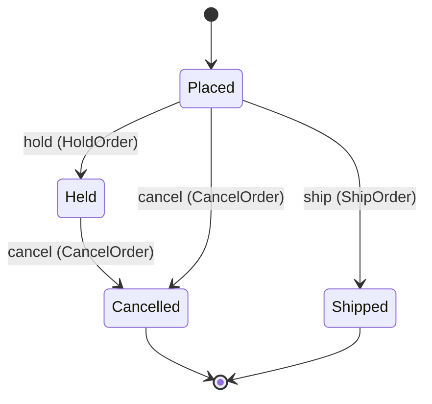

<!--
generated from oracle v1
model digest 4288d50a003fa7d5b39743327880aa7e2f97ff6d9408f8a5ddb908c8b6af79ee
contract digest 9c8f1b65057d7378da54f3072e27e6bb046abd22265bbdf1c1caadb94ecaa1bd
do not edit: regenerate with `ess generate`
-->

# Ordering

Orders, and the states one passes through on its way out of the building.

`oracle.order` is one of oracle's bounded contexts. [Back to the index](../index.md).

## Types

### `Email`

`oracle.order.Email` wraps `String` and is not interchangeable with one: the whole value of naming it separately is the crossings the model then refuses.

### `OrderId`

`oracle.order.OrderId` wraps `Uuid` and is not interchangeable with one: the whole value of naming it separately is the crossings the model then refuses.

## Entities

An entity is what this context is about: something with an identity that outlives any one request, a shape, and a lifecycle. The lifecycle is exhaustive — a move that is not drawn below is a move this specification does not permit, and that is the only way it says so. Every move is labelled with the command that takes it, because a move nothing can trigger is refused rather than drawn.

### `Order`

`oracle.order.Order`.

An instance is identified by `order_id`, a `oracle.order.OrderId`. The name is part of the model and not a convention: a view projects the identity under that name, so a projection inventing its own would disagree with the view.

It holds:

- `contact` — `oracle.order.Email`
- `alternate_contact` — `oracle.order.Email`
- `weight_grams` — `Integer`

It declares no relation to another entity, and no other entity names it.

Every instance satisfies `weight_grams >= 0` — a predicate over this entity's own fields, checked against them rather than stored as a sentence, so an invariant reading something the entity does not have is refused instead of documented.

Its state is a `oracle.order.Order.State`, one of `Cancelled`, `Held`, `Placed` and `Shipped`. That enum is synthesised from the lifecycle rather than declared beside it, so the states a view's filter compares and the states drawn below cannot disagree.

An instance is created in `Placed`. `Cancelled` and `Shipped` are terminal, so an instance may rest there forever. That is declared rather than inferred from having no way out: an entity that cannot leave a state is either finished or stuck, and only its author knows which.

Each move is taken by a declared command outcome, and a move nothing takes is refused as `missing_causation` rather than left as a state change nobody can trigger:

- `hold` — taken by `oracle.order.HoldOrder` on its `held` outcome
- `ship` — taken by `oracle.order.ShipOrder` on its `shipped` outcome
- `cancel` — taken by `oracle.order.CancelOrder` on its `cancelled` outcome

An instance is brought into existence by `oracle.order.PlaceOrder` on its `accepted` outcome.

Illegal transitions are illegal by absence: no rule forbids them, there is simply no arrow, because a rule would be a second place for the same truth to live. A diagram cannot show an absence, so the pairs it does not connect are listed here, derived from the same transitions — anything named below is a move this specification does not permit.

- `Cancelled` may not become `Held`
- `Cancelled` may not become `Placed`
- `Cancelled` may not become `Shipped`
- `Held` may not become `Placed`
- `Held` may not become `Shipped`
- `Shipped` may not become `Cancelled`
- `Shipped` may not become `Held`
- `Shipped` may not become `Placed`

Two views project it: [`HeldOrders`](#heldorders) and [`OpenOrders`](#openorders).

## Views

A view is what the outside world is promised it can observe. Each one says which instances it contains and how soon it reflects a command that has already returned, because "you can read this" without "how soon" is the promise every flaky suite is built on.

### `HeldOrders`

`oracle.order.HeldOrders`, shown to a person as "Held orders" and called `held` on the wire.

It reads [`Order`](#order).

It contains the instances where `state == Held` holds, and only those — so an instance a caller cannot find in here has been filtered out rather than lost.

It exposes:

- `order_id` — `oracle.order.OrderId`
- `contact` — `oracle.order.Email`

It declares no order, so the rows come back in whatever order the implementation has, and two reads may disagree.

**Eventual**: it catches up some time after the command returns, so a caller that reads it immediately may legitimately not see its own write yet. Nothing here says how long that takes, so nothing here lets a caller wait a fixed time and call it correct.

A generated scenario therefore retries the assertion until the projection catches up, rather than asserting once and racing it. The repair everyone reaches for instead is a sleep, which turns the suite into a test of the machine it runs on.

### `OpenOrders`

`oracle.order.OpenOrders`, shown to a person as "Open orders" and called `open` on the wire.

It reads [`Order`](#order).

It contains the instances where `state == Placed` holds, and only those — so an instance a caller cannot find in here has been filtered out rather than lost.

It exposes:

- `order_id` — `oracle.order.OrderId`
- `contact` — `oracle.order.Email`

It declares no order, so the rows come back in whatever order the implementation has, and two reads may disagree.

**Read-your-writes**: it is current the moment the command that changed it returns. A caller that has just created an invoice and cannot see it in here has been told a lie about what it did.

A generated scenario asserts it once, immediately after the command: a view promising this and not keeping the promise has to fail the suite rather than be retried until it passes.

## Commands

### `AmendOrder`

`oracle.order.AmendOrder`, shown to a person as "Amend order" and called `amend-order` on the wire.

It takes:

- `order_id` — `oracle.order.OrderId`
- `weight_grams` — `Integer`

It has two outcomes.

**`amended`** — The recorded weight changes; the order stays where it is. Taken when `weight_grams >= 0` holds of the input. It changes a `oracle.order.Order` without moving it along its lifecycle. The instance is the one named by the input field `order_id`. It emits `oracle.order.OrderAmended`. A test reaches it by constructing an input that satisfies that condition.

**`rejected`** — The weight was negative, so the order was left alone. The default branch, taken when no other outcome's condition matched. No entity in this specification changes. It reports `oracle.order.WeightOutOfRange`, carrying `submitted`. It emits nothing. A test reaches it by constructing an input that satisfies no other outcome's condition.

### `CancelOrder`

`oracle.order.CancelOrder`, shown to a person as "Cancel order" and called `cancel-order` on the wire.

It takes:

- `order_id` — `oracle.order.OrderId`

It has two outcomes.

**`cancelled`** — The order is cancelled, from Placed or from Held — never from Shipped. The default branch, taken when no other outcome's condition matched. It moves a `oracle.order.Order` from `Held` and `Placed` to `Cancelled`, along the declared move `cancel`. The instance is the one named by the input field `order_id`. It emits `oracle.order.OrderCancelled`. A test reaches it by constructing an input that satisfies no other outcome's condition.

**`wrong-state`** — The order has shipped or is already cancelled, so nothing was cancelled. Taken when the subject is resting in a state none of this command's moves start from — a `oracle.order.Order` in `Cancelled` and `Shipped`, which is what is left of the lifecycle once this command's own moves are taken away. The document lists none of it. No entity in this specification changes. It reports `oracle.order.OrderStateConflict`. It emits nothing. A test reaches it by driving an instance into one of those states and then issuing the command, because no input selects this branch.

### `HoldOrder`

`oracle.order.HoldOrder`, shown to a person as "Hold order" and called `hold-order` on the wire.

It takes:

- `order_id` — `oracle.order.OrderId`

It has two outcomes.

**`held`** — The order is held for review. The default branch, taken when no other outcome's condition matched. It moves a `oracle.order.Order` from `Placed` to `Held`, along the declared move `hold`. The instance is the one named by the input field `order_id`. It emits `oracle.order.OrderHeld`. A test reaches it by constructing an input that satisfies no other outcome's condition.

**`wrong-state`** — The order is not Placed, so it was not held. Taken when the subject is resting in a state none of this command's moves start from — a `oracle.order.Order` in `Cancelled`, `Held` and `Shipped`, which is what is left of the lifecycle once this command's own moves are taken away. The document lists none of it. No entity in this specification changes. It reports `oracle.order.OrderStateConflict`. It emits nothing. A test reaches it by driving an instance into one of those states and then issuing the command, because no input selects this branch.

### `PlaceOrder`

`oracle.order.PlaceOrder`, shown to a person as "Place order" and called `place-order` on the wire.

It takes:

- `contact` — `oracle.order.Email`
- `alternate_contact` — `oracle.order.Email`
- `weight_grams` — `Integer`

It has two outcomes.

**`accepted`** — The order is recorded, in Placed. Taken when `weight_grams >= 0` holds of the input. It creates a `oracle.order.Order`, which starts in `Placed`. The new instance's identity is published as `order_id` on `oracle.order.OrderPlaced`. It emits `oracle.order.OrderPlaced`. A test reaches it by constructing an input that satisfies that condition.

**`rejected`** — The weight was negative, and nothing was recorded. The default branch, taken when no other outcome's condition matched. No entity in this specification changes. It reports `oracle.order.WeightOutOfRange`, carrying `submitted`. It emits nothing. A test reaches it by constructing an input that satisfies no other outcome's condition.

### `ShipOrder`

`oracle.order.ShipOrder`, shown to a person as "Ship order" and called `ship-order` on the wire.

It takes:

- `order_id` — `oracle.order.OrderId`

It has two outcomes.

**`shipped`** — The order leaves the building, and is terminal. The default branch, taken when no other outcome's condition matched. It moves a `oracle.order.Order` from `Placed` to `Shipped`, along the declared move `ship`. The instance is the one named by the input field `order_id`. It emits `oracle.order.OrderShipped`. A test reaches it by constructing an input that satisfies no other outcome's condition.

**`wrong-state`** — The order is not Placed, so it was not shipped. Taken when the subject is resting in a state none of this command's moves start from — a `oracle.order.Order` in `Cancelled`, `Held` and `Shipped`, which is what is left of the lifecycle once this command's own moves are taken away. The document lists none of it. No entity in this specification changes. It reports `oracle.order.OrderStateConflict`. It emits nothing. A test reaches it by driving an instance into one of those states and then issuing the command, because no input selects this branch.

## Events

### `OrderAmended`

`oracle.order.OrderAmended`.

It carries:

- `order_id` — `oracle.order.OrderId`
- `weight_grams` — `Integer`

Emitted by `oracle.order.AmendOrder` on its `amended` outcome.

Nothing in this system reacts to it.

### `OrderCancelled`

`oracle.order.OrderCancelled`.

It carries:

- `order_id` — `oracle.order.OrderId`

Emitted by `oracle.order.CancelOrder` on its `cancelled` outcome.

Nothing in this system reacts to it.

### `OrderHeld`

`oracle.order.OrderHeld`.

It carries:

- `order_id` — `oracle.order.OrderId`
- `contact` — `oracle.order.Email`

Emitted by `oracle.order.HoldOrder` on its `held` outcome.

`handoff-on-held` reacts to it — see [Interactions](../interactions.md).

### `OrderPlaced`

`oracle.order.OrderPlaced`.

It carries:

- `order_id` — `oracle.order.OrderId`
- `contact` — `oracle.order.Email`
- `alternate_contact` — `oracle.order.Email`

Emitted by `oracle.order.PlaceOrder` on its `accepted` outcome.

`handoff-on-placed` reacts to it — see [Interactions](../interactions.md).

### `OrderShipped`

`oracle.order.OrderShipped`.

It carries:

- `order_id` — `oracle.order.OrderId`
- `contact` — `oracle.order.Email`

Emitted by `oracle.order.ShipOrder` on its `shipped` outcome.

`handoff-on-shipped` reacts to it — see [Interactions](../interactions.md).

## Errors

### `OrderStateConflict`

The order is not in a state this command acts from.

It carries nothing beyond its name, so a caller can tell what went wrong and not which value caused it.

Reported by `oracle.order.CancelOrder` on its `wrong-state` outcome.

Reported by `oracle.order.HoldOrder` on its `wrong-state` outcome.

Reported by `oracle.order.ShipOrder` on its `wrong-state` outcome.

### `WeightOutOfRange`

The weight was negative, so nothing was recorded.

It carries:

- `submitted` — `Integer`

Reported by `oracle.order.AmendOrder` on its `rejected` outcome.

Reported by `oracle.order.PlaceOrder` on its `rejected` outcome.

## Type crossings

Types in this context that the specification permits to be used as another type, or the other way round. Nothing else crosses: two newtypes over the same primitive stay distinct until a line in the specification says otherwise.

**`oracle.order.Email` may be used as `oracle.dispatch.Recipient`**, because:

> An order's contact address is where the carrier's notice goes; the dispatch context validates it again on the way out, so the order context does not have to know how.

Every crossing in the system is on one page: [Type crossings](../crossings.md).

---

Generated from oracle v1 · model digest `4288d50a003fa7d5b39743327880aa7e2f97ff6d9408f8a5ddb908c8b6af79ee` · contract digest `9c8f1b65057d7378da54f3072e27e6bb046abd22265bbdf1c1caadb94ecaa1bd`. Do not edit this file; change the specification and regenerate it with `ess generate`.
