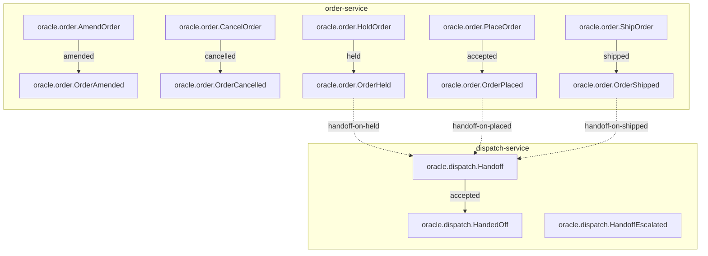

<!--
generated from oracle v1
model digest 4288d50a003fa7d5b39743327880aa7e2f97ff6d9408f8a5ddb908c8b6af79ee
contract digest 9c8f1b65057d7378da54f3072e27e6bb046abd22265bbdf1c1caadb94ecaa1bd
do not edit: regenerate with `ess generate`
-->

# oracle v1

Orders handed off to a carrier: the smallest specification that holds the constructs the normative example deliberately does not — all three `on_failure` policies, three bindings so dropping one leaves another to stay green, an outcome that updates an entity without moving it, a filtered view at each consistency level, and an event carrying two fields of one type so a mapping can be swapped rather than invented.

## The system as a graph

A command is accepted by the component that owns its context, emits the events one of its outcomes declares, and a dashed edge is a binding carrying an event into the next command. Design §9 begins one step earlier, at the actor who invokes the first command, and so does this graph: a solid edge out of an actor is a grant, and an actor drawn with no edge at all may invoke nothing — which is something the model says, not an arrow somebody forgot.

## Bounded contexts

- **[dispatch](domains/oracle-dispatch.md)** (`oracle.dispatch`) — Handing an order to a carrier, which may refuse for reasons no input predicts. Three types, no entities, no views, one command, two events, one error and no actors.
- **[Ordering](domains/oracle-order.md)** (`oracle.order`) — Orders, and the states one passes through on its way out of the building. Two types, one entity, two views, five commands, five events, two errors and no actors.

## Components

A component is a unit of ownership, not a deployment. How many of each runs, and what each needs, is [the topology](topology.md).

**`dispatch-service`** — Hands orders to a carrier. It owns [`oracle.dispatch`](domains/oracle-dispatch.md). It accepts `oracle.dispatch.Handoff`. It publishes `oracle.dispatch.HandedOff` and `oracle.dispatch.HandoffEscalated`.

**`order-service`** — Records orders and moves them through their lifecycle. It owns [`oracle.order`](domains/oracle-order.md). It accepts `oracle.order.AmendOrder`, `oracle.order.CancelOrder`, `oracle.order.HoldOrder`, `oracle.order.PlaceOrder` and `oracle.order.ShipOrder`. It publishes `oracle.order.OrderAmended`, `oracle.order.OrderCancelled`, `oracle.order.OrderHeld`, `oracle.order.OrderPlaced` and `oracle.order.OrderShipped`.

## The other pages

| page | what is on it |
|---|---|
| [dispatch](domains/oracle-dispatch.md) | the `oracle.dispatch` vocabulary: its types, entities, views, commands, events, errors and actors |
| [Ordering](domains/oracle-order.md) | the `oracle.order` vocabulary: its types, entities, views, commands, events, errors and actors |
| [Interactions](interactions.md) | every binding, with what it guarantees and what happens when it fails |
| [Type crossings](crossings.md) | every conversion this system permits, and the reason someone gave for it |
| [Topology](topology.md) | what each component needs in order to run |

---

Generated from oracle v1 · model digest `4288d50a003fa7d5b39743327880aa7e2f97ff6d9408f8a5ddb908c8b6af79ee` · contract digest `9c8f1b65057d7378da54f3072e27e6bb046abd22265bbdf1c1caadb94ecaa1bd`. Do not edit this file; change the specification and regenerate it with `ess generate`.
