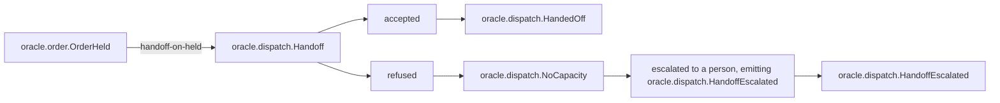
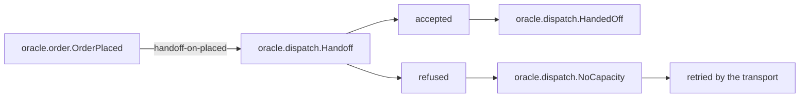

<!--
generated from oracle v1
model digest 4288d50a003fa7d5b39743327880aa7e2f97ff6d9408f8a5ddb908c8b6af79ee
contract digest 9c8f1b65057d7378da54f3072e27e6bb046abd22265bbdf1c1caadb94ecaa1bd
do not edit: regenerate with `ess generate`
-->

# Interactions

A binding is the only way an event in one context causes a command in another. Each one states how many times the command may run and what happens when it does not, because a binding that can fail quietly is the difference between specifying a system and specifying a demo.

[Back to the index](index.md).

## `handoff-on-held`

Tell the carrier a held order is not coming yet.

`oracle.order.OrderHeld` causes [`oracle.dispatch.Handoff`](domains/oracle-dispatch.md#handoff).

Delivered **at least once**, so `oracle.dispatch.Handoff` must be idempotent: the same event arriving twice must not do the work twice. "Exactly once" is what everyone believes they have until a retry proves otherwise, which is why this is written down rather than assumed.

When it fails it is **escalated** — surfaced to a person, who decides what happens next — and the system publishes `oracle.dispatch.HandoffEscalated` to say so. Surfacing something to a person happens outside the system, so that event is the only way a reader, a test or a conformance target can tell that the escalation happened at all.

It fills the command's input like this:

- `recipient` (`oracle.dispatch.Recipient`) ← the event's `contact` (`oracle.order.Email`). The two types differ, and the crossing is declared: "An order's contact address is where the carrier's notice goes; the dispatch context validates it again on the way out, so the order context does not have to know how."
- `label` (`oracle.dispatch.Label`) ← the literal `held`. Nothing in the model says how to read that as a `oracle.dispatch.Label`, so the compiler took it on trust rather than checking it.

## `handoff-on-placed`

Ask the carrier to collect a new order.

`oracle.order.OrderPlaced` causes [`oracle.dispatch.Handoff`](domains/oracle-dispatch.md#handoff).

Delivered **at least once**, so `oracle.dispatch.Handoff` must be idempotent: the same event arriving twice must not do the work twice. "Exactly once" is what everyone believes they have until a retry proves otherwise, which is why this is written down rather than assumed.

When it fails it is **retried**, on whatever schedule the transport provides. Nothing here says how many times, so nothing here says when it stops. A retry publishes nothing of its own, because it is already observable: it is another invocation of the command.

It fills the command's input like this:

- `recipient` (`oracle.dispatch.Recipient`) ← the event's `contact` (`oracle.order.Email`). The two types differ, and the crossing is declared: "An order's contact address is where the carrier's notice goes; the dispatch context validates it again on the way out, so the order context does not have to know how."
- `label` (`oracle.dispatch.Label`) ← the literal `placed`. Nothing in the model says how to read that as a `oracle.dispatch.Label`, so the compiler took it on trust rather than checking it.

## `handoff-on-shipped`

Confirm the handoff of an order that has shipped.

`oracle.order.OrderShipped` causes [`oracle.dispatch.Handoff`](domains/oracle-dispatch.md#handoff).

Delivered **at least once**, so `oracle.dispatch.Handoff` must be idempotent: the same event arriving twice must not do the work twice. "Exactly once" is what everyone believes they have until a retry proves otherwise, which is why this is written down rather than assumed.

When it fails the work is **dropped**. The system loses it, silently, and that is a decision someone made deliberately: `drop` is never a default, so this word was typed. Nothing is published, on purpose — an event here would make this a notification, which is a different decision.

It fills the command's input like this:

- `recipient` (`oracle.dispatch.Recipient`) ← the event's `contact` (`oracle.order.Email`). The two types differ, and the crossing is declared: "An order's contact address is where the carrier's notice goes; the dispatch context validates it again on the way out, so the order context does not have to know how."
- `label` (`oracle.dispatch.Label`) ← the literal `shipped`. Nothing in the model says how to read that as a `oracle.dispatch.Label`, so the compiler took it on trust rather than checking it.

## Events nothing reacts to

Legal, and worth seeing. An event with no reader inside the system is either a deliberate boundary — something outside consumes it — or a binding somebody forgot, and only a person can tell which.

- `oracle.dispatch.HandedOff`
- `oracle.dispatch.HandoffEscalated`
- `oracle.order.OrderAmended`
- `oracle.order.OrderCancelled`

---

Generated from oracle v1 · model digest `4288d50a003fa7d5b39743327880aa7e2f97ff6d9408f8a5ddb908c8b6af79ee` · contract digest `9c8f1b65057d7378da54f3072e27e6bb046abd22265bbdf1c1caadb94ecaa1bd`. Do not edit this file; change the specification and regenerate it with `ess generate`.
