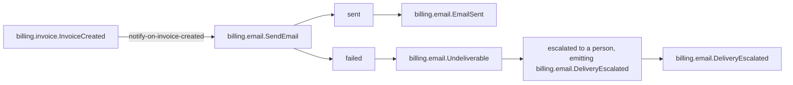

<!--
generated from billing v3
model digest 1e7906786567af32118eb2d0a8c3fcafa16c32c9649a80b60487fd2eeebc4c9c
contract digest a21fd36f0055057629f4c235962163cdd34a3d178aa068925bcb53be623af301
do not edit: regenerate with `ess generate`
-->

# Interactions

A binding is the only way an event in one context causes a command in another. Each one states how many times the command may run and what happens when it does not, because a binding that can fail quietly is the difference between specifying a system and specifying a demo.

[Back to the index](index.md).

## `notify-on-invoice-created`

Tell the customer an invoice exists.

`billing.invoice.InvoiceCreated` causes [`billing.email.SendEmail`](domains/billing-email.md#sendemail).

Delivered **at least once**, so `billing.email.SendEmail` must be idempotent: the same event arriving twice must not do the work twice. "Exactly once" is what everyone believes they have until a retry proves otherwise, which is why this is written down rather than assumed.

When it fails it is **escalated** — surfaced to a person, who decides what happens next — and the system publishes `billing.email.DeliveryEscalated` to say so. Surfacing something to a person happens outside the system, so that event is the only way a reader, a test or a conformance target can tell that the escalation happened at all.

It fills the command's input like this:

- `recipient` (`billing.email.EmailAddress`) ← the event's `customer_email` (`billing.invoice.Email`). The two types differ, and the crossing is declared: "An invoice's customer email is a deliverable address; the email context validates it again on the way out, so the invoice context does not have to know how."
- `template` (`billing.email.TemplateId`) ← the literal `invoice-created`. The compiler accepts text for this String-backed input; it does not check the type's invariants or whether the value names an external resource.

## Events nothing reacts to

Legal, and worth seeing. An event with no reader inside the system is either a deliberate boundary — something outside consumes it — or a binding somebody forgot, and only a person can tell which.

- `billing.email.DeliveryEscalated`
- `billing.email.EmailSent`
- `billing.invoice.InvoiceCancelled`
- `billing.invoice.InvoiceIssued`
- `billing.invoice.InvoicePaid`

---

Generated from billing v3 · model digest `1e7906786567af32118eb2d0a8c3fcafa16c32c9649a80b60487fd2eeebc4c9c` · contract digest `a21fd36f0055057629f4c235962163cdd34a3d178aa068925bcb53be623af301`. Do not edit this file; change the specification and regenerate it with `ess generate`.
