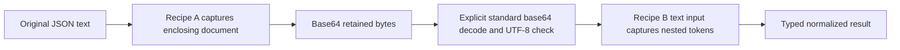

# Lexical JSON capture in normalization

Binding design for story:raw-json-normalization-provenance. This extends the
source-pinned normalization design with explicitly selected lexical preservation.
It binds canonical input semantics; it does not claim every permissive native
decoder behavior or runtime consumer is equivalent. Implementation and qualification
are recorded through the governed unit's implementation and qualification evidence.

## Minimal surface

Use `ess-normalization/4`, one optional recipe member `raw_json_inputs`, and an
explicit convenience entrypoint for decoding a retained base64 JSON document into
another checked recipe. Add no expression operation and no new stage type.

`raw_json_inputs` has the same branch/field/items path grammar as `binary64_inputs`:

```json
{
  "format": "ess-normalization/4",
  "raw_json_inputs": {
    "ingest": [
      [{"kind": "field", "name": "payload"}],
      [{"kind": "field", "name": "events"}, {"kind": "items"}, {"kind": "field", "name": "body"}]
    ],
    "retain_document": [[]]
  }
}
```

This is an envelope excerpt, not a complete recipe: branches, stages and their
source-pinned roots remain mandatory. `[]` is a root selector; `[[]]` is a list
containing that selector. An empty selector list captures nothing.

At the JSON text edge, replace every selected present token with the standard,
padded, canonical base64 encoding of its original UTF-8 token bytes. Then validate
the transformed value against the first stage's input schema and execute the
existing stages. First-stage input schemas describe the captured representation:
the selected leaf is string-shaped, normally a model Bytes newtype. The declaration
does not infer capture from Bytes, contentEncoding, a field name or a runtime value.

Current foundations: `normalize/recipe.rs:59` defines the closed recipe;
`recipe.rs:84` defines field/items selectors; `normalize.rs:204` parses before
execution; `execute.rs:27` validates stage input before expression evaluation;
`input.rs:28` already sees exact RawValue token text before discarding it.

Suggested Rust data names: `RawJsonInputs` and `Recipe::raw_json_paths(branch)`.
Reusing the existing selector representation is sufficient; a public NumberPath
rename is not required. Preserve its existing wire form and public compatibility
if implementation factors a common internal path type.

## Exact representation and presence

Required rules:

- Capture the complete selected JSON value token, from its first non-whitespace
  token byte through its final token byte. Exclude whitespace separating it from
  its parent punctuation and exclude transport whitespace before/after a root.
- Preserve everything within that token: member order, duplicate members where
  admitted below, internal whitespace, number spelling and string escape spelling.
  Capturing a JSON string includes its quotes and original escapes; it does not
  capture just the decoded string contents.
- An absent selected member stays absent. Capture creates no member or default.
- A selected terminal `null` becomes `bnVsbA==`, the base64 of the four bytes
  `null`. It does not remain JSON null. The token `"null"` has different bytes.
- Missing or null intermediate objects/lists are not traversed and remain as they
  were. A present intermediate value of the wrong container kind is left unchanged
  for the first input-schema validation to refuse; no speculative coercion occurs.
- Items captures every original array position, including terminal null elements.
  It does not select an index, filter an array or traverse arbitrary object members.
- Capture happens once per external text input. Later stage boundaries see base64
  strings and never capture them again. Canonical output serialization may change
  the surrounding record but cannot change the decoded retained token bytes.

Example: `{"payload":null}` becomes `{"payload":"bnVsbA=="}` before first-stage
validation, while `{}` still has no payload. A token `{ "n":1e0 }` and a token
`{"n":1.0}` produce different retained bytes even when a subsequent decoder sees
equal mathematical values. Root capture does not promise retention of an entire
transport buffer including leading/trailing whitespace.

The current missing-value/record-omission machinery already lives in
`normalize/eval.rs:124` and `eval.rs:131`; it need not gain a raw-value variant.

## Admission, paths and numeric interaction

Checks occur while sealing the recipe, before artifact generation:

1. The raw_json_inputs member is admitted only in format 4, even when its map is
   empty. Absent members stay omitted during serialization. Null is not a map.
   Duplicate branch keys are rejected by the same unique-map deserializer used
   for branches and binary64_inputs (`recipe.rs:63`, `recipe.rs:65`).
2. Each named branch must exist. Resolve paths against that branch's first input
   root, using checked wire names, exact declared object fields and declared array
   elements. Apply the existing path-depth bound. Do not accept open-object keys,
   additionalProperties wildcards, tuple indexes, recursive expansion or inferred
   discriminators. Nullable/optional intermediate containers are permitted as above.
3. The terminal non-null alternatives must be string-shaped and not exclusively
   null/never/Any. Optional/string newtypes are permitted. Retained schema refinements
   still apply to the base64 string at runtime; there is no promise that every
   syntactically valid input token satisfies every authored length/pattern/enum bound.
4. Refuse duplicate capture paths and any capture/capture ancestor relationship.
   A root capture therefore excludes all other capture paths for its branch.
5. Refuse capture/binary64 paths that are equal or related by ancestry in either
   direction. Disjoint sibling paths are permitted. This is checked explicitly,
   even when leaf-type checks would also reject the combination. Do not silently
   give either policy priority. A retained document's interior may be decoded under
   binary64 only at a later explicit document-decoding boundary.
6. Path comparison uses decoded exact field names and typed Items segments. Two
   different JSON escape spellings of the same selector name are the same path.
   No positional selector exists, so prefix comparison closes the overlap class.

Reuse located `object_type`, `unknown_field`, `collection_type` and existing depth
findings where their meaning is unchanged (`check.rs:108`, `check.rs:643`,
`check.rs:672`). New admission rules are `capture_input_type`,
`duplicate_capture_path`, `overlapping_capture_path` and `input_policy_overlap`.
Version/unknown-branch failures retain `operation_version` and `unknown_branch`.
Locations are `/raw_json_inputs/<escaped-branch>/<path-index>` or the offending
segment index. For overlaps, locate the later capture declaration and name the
earlier declaration in its detail; for binary64 overlap locate the capture path and
name the first conflicting numeric declaration in numeric-list order.

Retain existing checker phase ordering. Within capture checking, process branches
in map order and paths in declaration order. Once a duplicate/overlap finding exists
for a path, do not add a second leaf-type finding for the same path. Missing source
identities remain errors; they are never bypassed to infer a capture leaf.

## Captured tokens remain JSON, without numeric interpretation

Fixed profile, not additional per-capture switches:

| Property | Inside a captured token | Outside captures |
| --- | --- | --- |
| Complete JSON grammar | Required; comments, trailing commas, NaN, Infinity, malformed escapes refuse | Existing requirement |
| UTF-8 and escaped Unicode | Valid UTF-8 and well-paired surrogate escapes required; no replacement or normalization | Existing strict scalar/key decoding |
| Nesting | Existing depth 64 bound, measured from the original input root, still applies throughout the token | Existing depth 64 bound |
| Duplicate object members | Retained in original order, without key lookup or collapse | Existing duplicate-key refusal, including escape-equivalent keys |
| JSON numeric tokens | Grammar only; preserve spelling, huge integers/exponents and signed zero without numeric conversion | Existing exact policy or disjoint declared binary64 policy |

An object containing a captured member is outside that capture: duplicate names in
that parent are refused, even when both values would be captured. Thus selecting
one field never requires choosing between duplicate parent members. Duplicates
inside the selected token are ordinary retained bytes, not lookup semantics.

Allowing duplicate/numerically unrepresentable content only inside explicit captures
is new format-4 behavior, not a claim that the existing decoder allows it.
Today `input.rs:35` rejects duplicates recursively and `input.rs:64` converts every
number; `go_input.go.txt:35` deliberately defers strict Unicode/duplicate checks to
located decoding. A direct RawValue-to-base64 fast path would bypass Unicode and
depth checks and therefore does not implement this contract.

Implementation should use the pinned token parsers for grammar and token boundaries,
plus a bounded lexical walk for captured Unicode/depth checks, without constructing
numeric Values or deduplicating captured objects. Temporarily decoding strings for
Unicode validation must not become the retained output. Number lexemes must never
be passed through float/integer/exponent-value parsing inside captures.

## Entrypoints and deterministic failure order

Keep the existing text entrypoints: Plan::run_json, Rust Normalizer::normalize and
Go Normalizer.Normalize. A branch with at least one capture selector requires that
text edge. Plan::run and Rust Normalizer::normalize_value refuse that branch with
`input_capture_provenance` at `/input`, detail `raw JSON capture requires original
token bytes; use a text input entrypoint`. Refuse even when all capture paths might
be absent in the supplied Value. A caller-created base64 string is not proof of the
original token spelling. Branches with no actual capture paths retain value-API
behavior. Go currently exposes no decoded-value normalization entrypoint.

Do not change versions 1–3 or invent a new unknown-dispatch priority. Current text
entrypoints parse before branch lookup (`normalize.rs:204`, `go_runtime.go.txt:101`,
`rust_runtime.rs.txt:49`); preserve that order in version 4:

1. Validate that input contains one complete JSON value. Grammar/trailing-data errors
   remain `input_syntax` at `/input`, with the existing complete-value detail.
2. Decode and capture, stopping at the first input finding. At each outside object,
   validate/collect all decoded unique member names before child processing; process
   children in decoded-key order. Process arrays in index order, as the current
   reference/Go decoders do. Retain numeric and ordinary input error locations/details.
3. At a capture boundary, validate the token's Unicode and global depth, then encode
   its untouched bytes. Captured objects are traversed in source order for validation;
   duplicates are not rejected. Check node depth before its scalar/key Unicode, then
   visit children in source order. No number-representation finding can arise here.
4. For invalid Unicode inside a captured token, return `input_syntax` at the capture
   instance pointer with detail `captured JSON token contains invalid Unicode`.
   For excess depth, return `input_depth` there with the existing depth detail.
   Collapsing these locations to the capture boundary avoids pretending that a
   JSON Pointer can identify one of several retained duplicate members.
5. Look up the branch, then run existing input-schema, ordered requirement, expression
   and output-schema checks. Unknown branches use empty input policy, then the current
   `/branches` / `unknown_dispatch` refusal. No partial result is returned.

A decoded-value call to an existing capture branch stops at provenance refusal before
numeric preparation or schema checks. An unknown branch has no capture policy and
retains unknown-dispatch behavior. An empty raw_json_inputs map/list is not evidence
of an active capture and does not disable the value API.

The capture-specific lexical phase must be qualified against both pinned token APIs:
do not accidentally let library-specific recursion caps or Unicode replacement
semantics replace this declared order. This design-only read did not measure those
low-level parser edges; they are implementation verifiers, not observed successes.

Implementation qualification uses serde_json 1.0.151 RawValue's iterative grammar
scanner in Rust and Go 1.26.5 encoding/json.Decoder.Token with UseNumber and
InputOffset in Go. The latter retains original token slices and avoids jsontext's
fixed 10,000-level ReadValue limit. It never converts captured numbers or replaces
the retained bytes with decoded tokens. jsontext remains the strict Unicode checker
for Go scalar/key slices. Cases cover global depths 64/65 and 10,001, malformed
suffix priority, source-order capture traversal, and both generated Rust feature
configurations. Legacy templates retain their original parser behavior.

## Retaining a document and then decoding within it

Capture-only cannot inspect a retained base64 string or regain its original nested
tokens. The required sequence is two separately checked recipes and an explicit
base64-to-JSON-text boundary:



Provide a small public convenience entrypoint to make this usable with the same
error contract in all implementations, without an embedded expression interpreter:

- Reference: `Plan::run_base64_json(branch: &str, encoded: &str)`.
- Generated Rust: `Normalizer::normalize_base64_json(branch: &str, encoded: &str)`.
- Generated Go: `Normalizer.NormalizeBase64JSON(branch string, encoded string)`.

The argument is decoded base64 text, not a JSON-quoted string. Decode the standard
alphabet with canonical padding and zero unused pad bits; reject whitespace, URL-safe
alphabet, missing required padding and noncanonical trailing bits. Require canonical
re-encoding equality so Go's newline tolerance cannot create a different profile.
Then require UTF-8, and delegate unchanged bytes/text to the existing text entrypoint.

Failures, in exact order: `input_base64` at `/input`, detail `expected
canonical standard base64`; then `input_utf8` at `/input`, detail `retained JSON
bytes must be UTF-8`; then normal text-edge findings above. Empty decoded bytes
reach the ordinary complete-JSON-value refusal. Neither helper parses and reserializes
JSON before delegating. A terminal captured null is successfully decoded back to the
text `null`; whether Recipe B accepts it is decided by Recipe B.

These helpers establish an explicit bytes-to-text boundary, not cryptographic proof
that a value came from Recipe A. Each plan/report retains its own checked recipe and
source identities. The caller owns composition and any requirement to make both
calls atomic, select the retained field, preserve the original digest or attest the
relationship. A normalizer never accepts replacement recipes from retained data.
Depth is measured independently from zero for the new document, after the enclosing
capture has already passed its own original-document depth bound.

A separate helper is not mathematically necessary—callers could strict-decode base64,
check UTF-8 and call the text API themselves—but omitting it leaves this required
sequence outside the generated API and duplicates important error/encoding policy.
The three entrypoints are required in this unit. No Expr::parse_retained, stage
re-entry, lexical provenance bag or changed evaluator value type is necessary.

## Version/report consequences

Use format 4 even for bundle-only recipes using capture. Formats 1–3 refuse
raw_json_inputs, including empty maps, and retain their numeric/missing/Unicode
behavior. New readers accept 1–4; old readers must reject format 4 and the unknown
raw_json_inputs field. Their strict recipe parser already supplies the latter fence
(`recipe.rs:58`); their format allowlist supplies the former (`normalize.rs:41`).
Model-root admission must be extended from exactly version 3 to versions 3/4;
extended operations remain available in 2/3/4.

Use `ess-normalization-target/3` for every format-4 target. Its field shape
can remain unchanged: configuration, source identities, recipe digest and exact
file digests already bind the policy through source.recipe.json. The new report
format records the changed meaning of first-stage input validation: it sees captured
representation, not the original JSON token value. Do not add a second copied
capture-path table to reports. Keep target/1 for recipe 1/2 and target/2 for recipe 3.
An old report reader must explicitly reject target/3 rather than claiming support
merely because its fields can be deserialized. The current producer chooses report
versions in `target.rs:173`; there is no general report reader in the inspected path.

Absent capture declarations must preserve old canonical recipe bytes. Existing
source pins/schema bytes and report envelopes stay unchanged for versions 1–3.
The frozen legacy template family below preserves existing generated code bytes
and file maps. Test old-reader refusals, complete legacy file maps, recipe digests
and existing behavior separately. No model-schema or imported-bundle format change is required.

## Qualification and scope

The fixed duplicate-permitting, strict-Unicode capture profile is the selected
contract. It is not a claim that a source-language decoder rejects the same broader
malformed byte inputs. Broader byte admission is explicitly unsupported. Qualification
must exercise the pinned Rust and Go token parsers at depths 64/65, malformed
surrogates, duplicate capture parents and conflicting malformed/deep tokens.
Preserve the specified error order even where parser defaults differ.

No evaluator operation, positional-array source decoder or TypeScript target is
introduced by this unit. CLI normalize-run already uses the text API; the reference
and generated helpers provide the explicit retained-document composition. A new CLI
base64-input flag is outside this unit.

## Binding compatibility decision

Preserve legacy emitted bytes under the rules below. Freeze the five affected emitted templates from base
60ffcb2238ffef3a48d0db9555b6f2ca709ca2f7; format4 uses evolving source modules.
No generated helper or extra dependency/file is added to legacy targets.

## Concrete selection

Before editing the live modules, copy their current exact source bytes into an
explicit `normalize/legacy_v1_v3/` template directory:

| Frozen template | Legacy emitted path | Current source size |
| --- | --- | ---: |
| recipe.rs.txt | src/recipe.rs | 404 lines |
| input.rs.txt | src/input.rs | 191 lines |
| rust_runtime.rs.txt | src/lib.rs | 70 lines |
| go_input.go.txt | input.go | 180 lines |
| go_runtime.go.txt | runtime.go | 247 lines |

Total measured copied source: 1,092 lines. One family covers 1, 2 and 3: those
formats currently share these exact source templates. Do not create three copies.
Preserve provenance of the frozen baseline in a small directory README or source
comment outside the emitted templates; do not add comments to the frozen bytes.

For Rust, `target.rs:52` currently copies recipe.rs, input.rs and rust_runtime.rs.txt
verbatim. Dispatch these three includes by recipe format. Continue sharing unchanged
eval.rs, numeric.rs, execute.rs and diagnostic.rs. Add new capture/encoding modules
and any base64 Cargo dependency only to format-4 outputs; preserve the legacy
Cargo.toml literal in `target.rs:85` exactly. Do not emit unused new files into old
targets: the file set is part of the target's accounted output.

For Go, dispatch runtime.go/input.go template includes by recipe format
(`go_target.rs:30`). Preserve the legacy numberPaths/branch bindings text exactly;
emit capture bindings and any helper module only for format 4. Existing Go base64
support can use the standard library, so go.mod/go.sum need no new external pin.
Keep every unchanged shared Go template as it is; do not copy those unnecessarily.

Keep source.recipe.json canonical bytes unchanged when raw_json_inputs is absent.
Keep the same source/schema paths and identities. Emit report/1 for recipe 1/2,
report/2 for recipe 3 and report/3 only for recipe 4. The existing producer records
every emitted file's digest in `target.rs:183`; selecting unchanged template bytes
therefore preserves all legacy file digests and paths under identical inputs.

## Important qualification: generator provenance

`normalization-report.json` embeds `env!("CARGO_PKG_VERSION")` (`target.rs:179`).
Across an actual package release bump, its generator_version must change truthfully.
Do not freeze or forge the producer version to claim complete byte equality.

The concrete promise should be: for identical admitted legacy input, target identity
and generator version, every emitted byte remains identical; across a release bump,
legacy source/code/schema/manifest bytes and their file-digest map stay identical,
while the report's generator_version changes as required by provenance. The report
does not hash itself, so that provenance change does not force other file changes.

## Required preservation verifier before implementation

Record exact pre-change complete file maps or per-file SHA-256 maps for representative
format-1, format-2 (including numeric paths) and format-3 (model roots) recipes in both
languages, with fixed package/module identities. Later compare all paths and bytes,
including manifests and report format/roots/recipe digest. Only the explicit current
generator_version substitution in an expected report is permitted when testing across
a package version bump. Do not normalize source text, omit added paths or compare only
runtime behavior. Existing target tests currently check determinism and self-accounted
digests, which alone would accept coordinated output drift
(`normalization_go.rs:166`, `normalization_rust.rs:151`).

Native tests must keep compiling/executing the frozen legacy outputs. New format-4
fixtures exercise live modules and the new helper. A deliberate later legacy bug fix
would require a separately recorded generation migration; these five snapshots must
not silently track live implementation edits.
