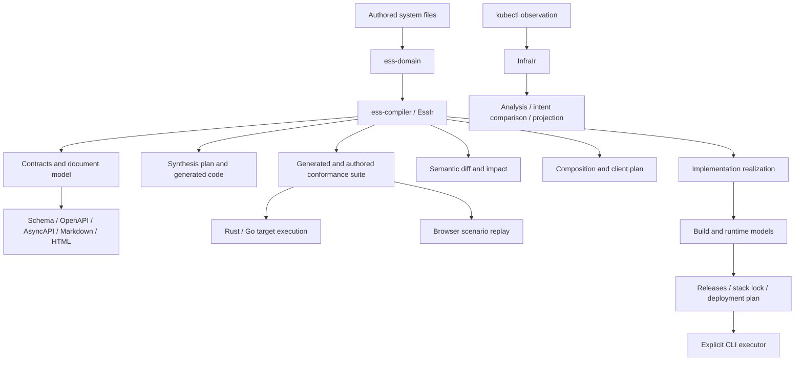

# ESS architecture review and maturity assessment

**Reviewed:** 2026-09-05. **Source:** `fd06a4d61bfb7b4990617810655dc181d6a3ab00`
(`fix(docs): complete release change records for website publication`), workspace version
`0.18.0`. This is a repository-wide design review, not a release certification.

## Review basis

The primary `ess` checkout was on `main`, clean and equal to the fetched `origin/main`. The
previous review examined `d47067c6d6561b8f151a7a41fc2bf7456fa0629f`; this review includes the 79
commits subsequently pulled. The two earlier local documentation edits were saved before that
pull; upstream incorporates the URL corrections and supersedes the workflow pin. They are not
part of this review's source tree.

Review and documentation work used a managed checkout at the exact reviewed commit. No
implementation fixes or schema renames were made. This document, the public outlook, navigation
links, and the AEP tracking record are review deliverables rather than reviewed implementation.
File/line citations below refer to the source commit above, before those documentation changes.
Historical design documents were read as evidence of intent; their claims were checked against
implementation and tests.

The standard used here is the project's own purpose: deterministic typed descriptions of system
semantics, explicit gaps at adapter boundaries, generated contracts, and evidence about an
implementation. A general-purpose modeling framework, universal reversibility, and a production
deployment control plane are not requirements imposed by this review.

## Overall assessment

ESS has a coherent center and an increasingly useful set of consumers. Its best abstractions
separate logical names from generated names, authored declarations from resolved references,
semantic requirements from implementation choices, and executable scenarios from the target
that answers them. Those decisions should be preserved.

The main maturity problem is **incomplete propagation of guarantees across boundaries**. The
model has grown faster than its completeness checks: new fields can affect generated contracts
without appearing in semantic diff; a compiler-owned JSON shape can be read without reestablishing
compiler invariants; a suite can survive without the coverage refusals that explain its omissions.
The full offline gate is green while targeted probes demonstrate these failures. More features
alone will widen this gap.

The delivery subsystem raises the stakes. The pure lowering library is a good boundary, but the
CLI now builds, publishes, fetches, upgrades, and uninstalls. It must distinguish well-formed
documents, internally consistent plans, trusted evidence, and authorized execution. Those are
four different claims.

Maturity should first mean reliable refusal, complete accounting, stable identity, and usable
diagnostics for a declared subset. Additional language targets and model kinds should follow that
foundation.

## Architecture map

There are 20 workspace crates under five directories, plus two implementation examples in the
workspace. The directories are navigation groups; the Cargo graph determines actual dependencies.
See [workspace membership](../../Cargo.toml#L1) and [the boundary contract](../../AGENTS.md#L23).

| Area | Responsibilities and important seams |
| --- | --- |
| `specify` | `ess-primitives` owns facts, predicates, clocks and common evidence values. `ess-domain` parses and validates authored declarations. `ess-compiler` resolves them into `EssIr`, stable semantic references and dependency graphs. `ess-composition` selects surfaces from exact independently compiled models and emits a client plan. `ess-realization` records implementation artifacts and entrypoints bound to an exact specification. |
| `generate` | `ess-gen` produces schemas, protocols and documents from `EssIr`; its document model feeds separate Markdown and HTML renderers. `ess-synth` emits implementation structure plus obligations. `ess-openapi` imports and projects a separate service-interface model. `schema-contract` treats adopter-owned JSON Schema as its own authority. `ess-deployment` compiles build/runtime/delivery documents, verifies manifest consistency, resolves locks and projects BuildKit/Helm inputs. |
| `verify` | `ess-conformance` compiles generated and authored scenarios, runs target adapters, emits Go tests and a browser scenario player. `ess-diff` compares model revisions and computes impact and artifact obligations. |
| `infra` | `ess-kubernetes` is the live `kubectl` edge. `infra-domain` models observations, `infra-compiler` resolves them, `infra-analyze` builds analyses/graphs, `infra-spec` owns intent/drift/simulation, and `infra-project` produces manifests plus obligations. This is a separate bounded context sharing primitives, not the system specification's deployment backend. |
| `edge` | `ess-cli` owns filesystem discovery, command routing, output writing and external execution. `ess-xtask` owns repository projection/schema/release checks. |

The diagram is a flow map, not a claim that every arrow has the same validation or trust
properties. In particular, browser replay is not target execution, and digest equality is not
evidence verification.

## Representative flows inspected

### Authored system to contracts and change analysis

`load::specification` discovers YAML, builds a `SourceMap`, parses `RawSpecFile`, assembles the
whole specification, then calls the compiler
([loader](../../crates/edge/ess-cli/src/load.rs#L25),
[authored shape](../../crates/specify/ess-domain/src/spec.rs#L45)). Assembly before cross-file
validation avoids file-order-dependent name resolution. Typed handles are internal; persisted
consumers use semantic references.

The billing example exercises named types, Account/Invoice ownership, commands, emitted payloads,
assignments, views, components and bindings. Schema projection embeds its reachable type closure
under `$defs`; documentation first becomes a `Document` with typed page targets. The repository
gate regenerates committed projections and the source-file JSON Schema. A separate mutation of
the billing ownership cardinality exposed the incomplete diff/impact path in F01.

### System and authored scenarios to conformance evidence

Generated scenarios derive obligations from `EssIr`; authored `ess-scenario/1` documents compile
against that same model and merge under stable scenario ids. Suite formats now reach
`ess-conformance/4`, with earlier supported versions readable. A target interface supplies
execution, observation, ordered scans and elapsed-time readings. Tests exercise both correct and
deliberately faulty targets, including an eager producer masquerading as an early-stopped scan
and clocks that fail to hold a requested interval
([halt tests](../../crates/verify/ess-conformance/tests/halt.rs#L1),
[elapsed tests](../../crates/verify/ess-conformance/tests/elapsed.rs#L1)).

The browser player consumes an authored suite and a projected model. It replays asserted outcomes;
it does not establish that an implementation produced them. The distinction is documented, but
its local state/view calculations still need fidelity checks (F15).

### Specification to independent delivery

The chain is an authored component descriptor, semantic specification, realization, build graph,
runtime mapping, release manifests/bundle, stack requirements/catalog, exact stack lock, private
environment bindings, then a deployment plan. Build/runtime compilers check references and
digests; stack resolution selects exact candidates; Helm generation supplies configuration-neutral
defaults. The deployment integration test follows this complete chain
([test](../../crates/generate/ess-deployment/tests/deployment.rs#L358)).

External work is in the CLI: Docker Buildx, ORAS and Helm. `reconcile` compares a caller-supplied
previous deployment with the desired plan, applies changed releases, and requires an explicit
removal option. It is not an observation-driven continuous reconciler. Persisted plans cross into
that executor without sufficient revalidation (F02), and release metadata checks do not establish
the truth of attached evidence (F11).

### Observed infrastructure to analysis and projection

The scanner gathers an ordered kind list, sanitizes Secrets, then writes an observation.
Observation parsing and compilation resolve Kubernetes references into a separate `InfraIr`.
Downstream analyses and projections do not select kubeconfig authority. This is a sound isolation
boundary, but malformed Secret shapes and partially understood selectors undermine its promised
input accounting (F05–F06).

### Independent contracts and composition

OpenAPI import creates `ess-service-interface/1`, not an invented lifecycle model. A separate
schema-registry workflow validates instances and projects TypeScript while retaining JSON Schema
as authority. Composition pins an imported system/component and gathers its reachable surface;
the generated client plan currently captures names and operations rather than complete payload
types. These are useful distinct workflows, but their names and guarantees need to remain distinct
(F04, F12–F13, F17).

## Significant findings

Priority indicates consequence and sequencing, not estimated implementation effort. **P0** closes
false confidence or output-boundary failures before broader reliance. **P1** hardens supported
workflows. **P2** improves discoverability and extension cost. A demonstrated defect below is
supported by a current probe or a directly exercised repository test; other observations are
explicitly classified.

### F01 — New semantic fields can disappear from diff and impact

**P0 · Demonstrated defect; systemic extension weakness.** The entity comparator does not compare
relations. Component comparison omits `reached_by` and `cli`; outcome comparison omits `sets` and
`refuses`; view comparison omits parameters and ordering. See
[entity comparison](../../crates/verify/ess-diff/src/diff.rs#L1000),
[components](../../crates/verify/ess-diff/src/diff.rs#L742),
[outcomes](../../crates/verify/ess-diff/src/diff.rs#L1210), and
[views](../../crates/verify/ess-diff/src/diff.rs#L1343). The entity dependency walk also predates
relation-target dependencies ([graph](../../crates/specify/ess-compiler/src/graph.rs#L550)).

**Observed:** changing only billing's `Account.invoices.cardinality` from `many` to `one` validates.
The before/after digests differ (`56090788…` and `7732d4c5…`), but the delta contains `changes: []`.
Impact reports `answer: narrowed`, `owed: []`, and zero of 50 generated artifacts owed. The
relation is carried into schema/document output, so this is consequential, not merely a missing
description of an equivalent rewrite.

**Why it matters:** a consumer can skip contract regeneration or review after a meaningful model
change. A successful parser/projection test for a new construct does not establish completeness of
all consumers. Existing directional-diff tests cover the vocabulary they knew when written.

**Direction:** add changes and dependency edges for these fields, and make an unexplained model
difference conservatively prevent a narrowed-empty answer. Introduce a field-by-field semantic
coverage matrix and mutation tests spanning compilation, diff, impact and generation. An interim
whole-model fallback causes extra work; that is preferable to falsely claiming nothing is owed.
Do not equate every digest change with semantic change: naming defaults and documentation metadata
need explicit canonical treatment (F13).

### F02 — Reading a persisted IR does not reestablish its invariants

**P0 · Demonstrated defect and architectural weakness.** `BuildIr::from_json` promises rejection
of invalid graphs and formats but only calls Serde. Runtime, component, stack-lock and deployment
readers follow the same structural pattern
([build](../../crates/generate/ess-deployment/src/build.rs#L267),
[runtime](../../crates/generate/ess-deployment/src/runtime.rs#L230),
[component](../../crates/generate/ess-deployment/src/component.rs#L70),
[deployment](../../crates/generate/ess-deployment/src/environment.rs#L130)). Rejecting unknown
fields does not validate a format string, cross-reference, map-key identity or execution order.

**Observed:** a build marked `future/99`, with no nodes and `order: [missing]`, is accepted. A
deployment with that marker, no releases and `rollout_order: [missing]` is also accepted; CLI
`reconcile --dry-run` prints empty apply/remove sets and succeeds. The executor later trusts rollout
membership with `expect` ([CLI](../../crates/edge/ess-cli/src/main.rs#L1613)). This review did not
invoke a real executor to demonstrate its downstream effects.

The same validity ownership problem appears in the infrastructure API: `InfraIr.model` and its
maps are public. A current Rust probe takes a resolved service-account handle, clears the same
IR's account map, and makes its supposedly total lookup panic
([public model](../../crates/infra/infra-compiler/src/ir.rs#L470)).

**Direction:** distinguish raw persisted DTOs from validated IR. Conversion should validate
format, keys, references, graph order and domain constraints before any analysis or execution.
Make invariant-bearing collections private; expose queries and validated transformations. Verify
nested bundle models, not only the outer envelope and their self-consistent hashes. Costs are
additional conversion code, Rust API changes, and potentially rejecting documents earlier readers
accepted; preserve valid existing bytes and test old/current readers explicitly.

### F03 — Conformance verdicts can outlive the accounting that qualifies them

**P0 · Demonstrated defect; partial improvement since the earlier review.** Text-mode synthesis
now prints each refusal and each out-of-component obligation. That is a real improvement.
However, JSON/YAML and written suite files contain only the suite; `conform run --path` directly
takes `.suite` from synthesis
([run](../../crates/edge/ess-cli/src/main.rs#L2210),
[synthesis output](../../crates/edge/ess-cli/src/main.rs#L2319)).

**Observed:** a valid model containing the malformed nested guard in F09 produces two explicit
synthesis refusals and zero scenarios. Writing that suite succeeds. Running it against the
billing reference target reports `passed`, with zero checks. The runner's empty-set verdict is
mathematically defensible; presenting it as conformance to the source without preserved coverage
is the defect ([verdict](../../crates/verify/ess-conformance/src/report.rs#L551)).

The standalone report reader likewise checks shape, not claims: a report with `format: other/99`,
`status: passed`, one total scenario and ten failed scenarios is accepted
([reader](../../crates/verify/ess-conformance/src/evidence.rs#L18)). It records a specification
digest and suite-format version, but not the exact suite digest or a complete generated/authored/
outside/refused accounting. The existing draft story about counting non-passes as failures is
part of this broader verdict vocabulary issue.

**Direction:** persist a coverage manifest with the suite, preserve it through language emission,
bind evidence to the exact executed suite, and separate execution status from specification
coverage. A strict mode should require explicit acceptance of incomplete coverage. Validate report
versions and derived counts. This needs a coordinated suite/report migration and updates in
downstream consumers; do not reinterpret all old zero-test reports as proven failures.

### F04 — OpenAPI support is declared by keyword name rather than preserved meaning

**P1 · Demonstrated defects.** The importer returns immediately for `$ref`, models integers and
numbers without enum constraints, and drops arrays without `items`; its generic keyword allowlist
still treats those keys as understood
([schema conversion](../../crates/generate/ess-openapi/src/lib.rs#L721),
[gap accounting](../../crates/generate/ess-openapi/src/lib.rs#L859)).

**Observed on 3.1 input:** an integer enum becomes unconstrained integer; an array schema with no
`items` disappears; a sibling pattern beside a local `$ref` disappears. All three report zero
coverage gaps and refusals. Missing local schema targets are counted separately, but the persisted
interface itself does not carry the entire import report.

**Why it matters:** a contract can be weakened while the tool reports full coverage. The decision
to import a limited service/interface model instead of guessing entities and lifecycles is good;
the supported subset must be exact in both representation and diagnostics.

**Direction:** account for consumed semantics by schema variant and dialect. Every unrepresented
constraint must become a gap or refusal; `$ref` siblings must be considered before returning.
Retain diagnostics/provenance alongside persisted output. Add semantic counterexamples, not only
round trips of already-supported output. Stricter handling will refuse more existing contracts;
reporting that incompleteness is the intended cost.

### F05 — Secret sanitization assumes the shape it is supposed to make safe

**P0 · Demonstrated defect.** The sanitizer only replaces `data` and `stringData` when they are
objects; other shapes remain in the response that is serialized
([sanitizer](../../crates/infra/ess-kubernetes/src/lib.rs#L107)).

**Observed:** using a local fake `kubectl` returning a synthetic Secret with a string-valued
`data` field caused the exact synthetic value to reach the observation file. No real credentials
or cluster were used. Current tests cover proper maps and a missing `items` array, not this
malformed field shape. This contradicts the unconditional pre-serialization guarantee in
[the adapter contract](../../crates/infra/ess-kubernetes/AGENTS.md#L15).

**Direction:** remove or reject secret-bearing fields regardless of their value shape, then
construct the sanitized representation from a validated allowlist. Cover malformed items,
malformed annotations and nested shapes with mutation/property tests. Strict refusal reduces
availability against unexpected responses, but a credential edge must not silently preserve raw
data when its shape is surprising.

### F06 — Partial observation can become apparently complete infrastructure knowledge

**P1 · Demonstrated selector loss; source-confirmed scope weakness.** `RawSelector` represents
`matchLabels` only and ignores other fields
([raw selector](../../crates/infra/infra-domain/src/raw.rs#L159)). An expression-only selector
therefore becomes an empty label selector. In the earlier synthetic selector fixture, re-read
against the current implementation, the compiled selector is empty; the unchanged matching
algorithm gives that empty conjunction broad meaning. PDB coverage or workload relationships can
therefore be inferred from less information than Kubernetes supplied.

Separately, `scan` retries every failed `kubectl get ... -A` without `-A`
([scanner](../../crates/infra/ess-kubernetes/src/lib.rs#L70)). A permissions failure can silently
turn a cluster-wide observation into one namespace's data without a durable scope qualification.

**Direction:** record collection scope, per-kind completeness and unsupported selector terms in
typed observation/coverage data. Unsupported selection must yield unknown/refused relationships,
not match-all. Retry only failures for which scope is preserved or explicitly acknowledged. This
will make some diagnoses inconclusive; that is preferable to treating absence from a partial scan
as absence from the cluster. Adding persisted coverage requires an explicit format decision.

### F07 — Model validity is mistaken for target-language representability

**P1 · Demonstrated defects.** Rust naming normalizes distinct source names without a complete
target-symbol collision check; optional recursion is emitted without the indirection Rust needs
([names](../../crates/generate/ess-synth/src/rust/name.rs#L20),
[type mapping](../../crates/generate/ess-synth/src/rust/layout.rs#L170),
[type planning](../../crates/generate/ess-synth/src/plan.rs#L540)).

**Observed:** `demo.core.FooBar` and `demo.core.Foo_Bar` produce two `FooBar` definitions. A struct
`Link { next: Optional<Link> }` produces `Option<Link>`. Both are reported as generated with zero
refusals; compiling the emitted crates fails with E0428 and E0072 respectively. The analogous
TypeScript projector reserves definition names separately from the requested root, so its root can
collide with a definition ([projection](../../crates/generate/schema-contract/src/typescript.rs#L66)).

**Direction:** perform target-specific feasibility analysis before writing files: symbol and path
allocation, reserved words, wire-property uniqueness, recursion layout and target-supported types.
Use indirection where semantics permit it and otherwise emit a refusal. Keep the source language
independent of Rust's layout rules. Costs are target-specific planning and possible generated API
changes; these are cheaper to manage explicitly than shipping uncompilable output labeled complete.

### F08 — Primitive semantics diverge between contracts, facts and generated codecs

**P1 · Demonstrated numeric defect; architectural consistency weakness.** Semantic fact numbers
are `f64`, including conversion from `i64`
([Number](../../crates/specify/ess-primitives/src/facts.rs#L33)). Conformance admits Decimal as a
number and treats several constrained primitives, including UUID, as text
([primitive admission](../../crates/verify/ess-conformance/src/input.rs#L561)). Generated protocol
contracts and Rust wire code have their own representations and validation paths
([projection primitives](../../crates/generate/ess-gen/src/types.rs#L145),
[wire code](../../crates/generate/ess-synth/src/rust/wire.rs#L1)).

**Observed:** `9007199254740992_i64` and `9007199254740993_i64` become equal fact numbers;
`Number::from(i64::MAX).is_integral()` is false. Tests explicitly admit arbitrary text as a UUID
fact. Consequently a conformance result does not establish the same value-domain guarantees that
a schema validator may enforce.

**Direction:** publish a primitive semantics matrix distinguishing abstract value, predicate value
and each wire encoding. Use exact integer/decimal representations where the domain promises them;
share admission vectors across Rust, Go, schemas and browser adapters. Preserve independent
implementations where useful for detecting errors, but give them one normative contract. Changing
number serialization and comparison is a semantic migration, not a cosmetic refactor.

### F09 — “Validated model” does not consistently mean typechecked expressions

**P1 · Demonstrated defect.** Command guard validation checks the root field, while the conformance
input walker later resolves the full path
([guard validation](../../crates/specify/ess-domain/src/command.rs#L1316),
[typed path resolution](../../crates/verify/ess-conformance/src/input.rs#L395)).

**Observed:** a Decimal input `amount` with guard `amount.nonexistent > 0` passes `ess specify
validate`. Conformance synthesis refuses both branches because the path cannot be read. This is a
malformed expression, not an implementation behavior intentionally left as an obligation.

**Direction:** make resolved expression paths and operand types a compiler responsibility, reused
by consumers. Keep satisfiability/witness synthesis separate: a type-correct expression can still
be unsupported by a particular oracle. Moving the reusable resolver may require a small compiler
API and careful separation from conformance-specific witness machinery. Acceptance will become
stricter for specifications that currently validate but cannot mean what they say.

### F10 — Filesystem ownership is weaker than the semantic/output separation

**P0 for output containment; P1 for lifecycle · Demonstrated defect and architectural weakness.**
The general writer joins unvalidated artifact paths onto the output root. `--include` accepts an
arbitrary page id; `PageId` is a public string wrapper
([writer](../../crates/edge/ess-cli/src/main.rs#L2016),
[include parser](../../crates/edge/ess-cli/src/main.rs#L2054),
[page identity](../../crates/generate/ess-gen/src/document.rs#L87)).

**Observed:** `--kind site --include ../../escaped=<temporary-markdown> --out <temporary-root>`
writes `../../escaped.html` outside the requested output root. This is caller-controlled local
input, not a claim of remote exploitation. Duplicate included ids can also collide with generated
pages; the special site path collects directly into a map rather than using the ordinary
duplicate-path gate ([site dispatch](../../crates/edge/ess-cli/src/main.rs#L2088)).

Source discovery recursively consumes all YAML under the specification root, whereas authored
scenario discovery reads one directory level
([spec discovery](../../crates/edge/ess-cli/src/load.rs#L25),
[scenario discovery](../../crates/edge/ess-cli/src/main.rs#L2458)). Generated YAML inside a source
root can break the next validation. Scenario directories containing only subdirectories can
produce an empty successful result, already tracked in the repository. General output writes
are incremental, with no ownership manifest, stale-file removal policy or atomic directory swap.

**Direction:** validate relative artifact/page paths and uniqueness before any write; provide
atomic staging and an explicit owned-file manifest. Give authored documents a manifest or uniform
typed discovery rules so different file kinds can coexist predictably. Preserve authored additions
when retiring generated files. This adds bookkeeping and migration guidance but removes accidental
overwrites, stale output and directory-layout-dependent meaning.

### F11 — Delivery consistency, provenance trust and execution state need separate contracts

**P1 · Architectural weakness and explicit trust tradeoff.** The pure deployment library is well
separated from external execution. Its release verifier checks matching digests, expected output
names/kinds and presence of required evidence kinds
([verification](../../crates/generate/ess-deployment/src/release.rs#L137)). It does not fetch or
validate a signature, evaluate conformance, or prove that a build produced an artifact. The release
action attaches an arbitrary configured check log as conformance evidence
([action](../../.github/actions/release-component/release.sh#L46)). These are metadata consistency
checks, not independent attestation.

The CLI's bundle cache is addressed by an OCI manifest digest, but a cache hit revalidates the
bundle's internal consistency without proof linking those local bytes to that OCI manifest
([fetch](../../crates/edge/ess-cli/src/main.rs#L1457)). The chart cache at least stores a payload
checksum, which detects some corruption but is still local trust. This is a documented-assumption
gap; no registry, signature or cache-substitution attack was performed.

`reconcile` trusts the supplied previous desired document as the applied baseline. It records no
durable per-release execution result and skips equal desired entries without querying actual
state ([reconciliation](../../crates/edge/ess-cli/src/main.rs#L1613)). Partial failure, retries,
manual cluster changes and an incorrectly selected baseline can therefore defeat the meaning
suggested by “reconcile.” `--atomic` applies to one Helm release, not the multi-release plan.

**Direction:** name the present verifier a consistency verifier in documentation. Define separate
evidence-verification policy and explicit execution receipts/recovery semantics before claiming
attested releases or convergence. Retain OCI-manifest/layer evidence sufficient to revalidate cached
content, or state the cache as a trusted local boundary. Move executor orchestration into testable
edge modules with injected process/filesystem clients. Costs include trust policy, receipt formats
and integration tests; avoid building a continuous controller unless a concrete use case needs it.

### F12 — Conceptual groups are useful, but several nouns now carry incompatible meanings

**P2 · Architectural weakness and tradeoff.** A semantic component owns domains and exposes
commands; a deployment `ComponentSpec` is a repository descriptor for an independently releasable
system with runtime and chart release units
([semantic component](../../crates/specify/ess-domain/src/component.rs#L1),
[delivery descriptor](../../crates/generate/ess-deployment/src/component.rs#L27)). Composition's
service is an alias for a selected semantic component, whereas a stack service resolves a released
system. A semantic workload states requirements; a runtime workload supplies container/storage
choices. “Realization” records implementation artifacts and entrypoints, while runtime is another
physical implementation mapping.

There is also a boundary tension: realization says an interface change should not change the
semantic system, but `reached_by` and CLI command/flag layout reside in the semantic component
([reach](../../crates/specify/ess-domain/src/component.rs#L103),
[realization purpose](../../crates/specify/ess-realization/src/lib.rs#L1)). A single reach enum is
adequate for one exposed surface, but a component served simultaneously through CLI and HTTP has
no comparably clear representation there.

**Direction:** adopt the glossary and grouping proposal below first. Decide explicitly whether
entrypoint layout is a contract-level interface or a realization choice; keep behavior/actor
permissions in the semantic model either way. Let one semantic component participate in several
entrypoints without duplicating domain ownership. Preserve separate infrastructure and semantic
models. Do not use vocabulary cleanup as justification for one universal object registry.

### F13 — Format identity, schema identity and semantic identity are not a single contract

**P1 · Architectural weakness; compatibility tradeoff.** Format discriminators vary: most use
`format`, realization uses `type`, and suites carry `suite_version` in provenance. Composition
uses `ess-composition/1` for authored input and compiled output, although their shapes differ
([input](../../crates/specify/ess-composition/src/lib.rs#L277),
[output](../../crates/specify/ess-composition/src/lib.rs#L548)). Domain versions serialize as
numbers in some documents and strings in others; deployment adds a separate SemVer release.

`EssIr::source_digest` hashes compact serialized IR, not source-file bytes. Other model digests
hash pretty JSON plus newline. This is deterministic within each implementation, but the byte
profile and semantic normalization are part of an effective persisted ABI
([semantic digest](../../crates/specify/ess-compiler/src/ir.rs#L1569),
[delivery canonicalizer](../../crates/generate/ess-deployment/src/identity.rs#L128)). Public comments
already contain historical explanations that no longer match the current owning crate.

The generated source-file JSON Schema has no stable `$id`; it describes deserializable syntax,
not whole-system semantic validity. Generated entity/type/message schemas are self-contained but
also lack `$id`, while the schema-registry/TypeScript workflow requires an absolute `$id`
([schema generation](../../crates/edge/ess-xtask/src/main.rs#L423),
[contract generation](../../crates/generate/ess-gen/src/schema.rs#L154),
[registry projection](../../crates/generate/schema-contract/src/typescript.rs#L69)). An ESS-generated
schema consequently is not immediately an adopter-owned registry entry. That can be a deliberate
separation, but the CLI grouping currently suggests closer interchangeability.

**Direction:** publish a format catalog with producer, reader, version policy, canonical byte
profile, validation level and supported migrations. Add distinct schema resource identities only
where a consumer needs them. Name `source_digest` as a compiled-model digest in prose now; preserve
existing bytes. A future serialized envelope should distinguish syntax version, system contract
version, release version and content digest. Do not mint `ess-ir/2` merely to tidy Rust APIs or
rename every v1 format in place.

### F14 — Diagnostic structure is reconstructed from presentation strings

**P2 · Architectural weakness.** Domain validation errors carry string locations; the compiler
infers diagnostic families by splitting those strings and searches source text to recover
locations ([family bridge](../../crates/specify/ess-compiler/src/resolve.rs#L565),
[source model](../../crates/specify/ess-compiler/src/source.rs#L1)). The heuristic is acknowledged,
and accumulated diagnostics with repair hints are a strong feature.

**Why it matters:** adding or rewording a location can change a machine-facing code, and semantic
diagnostics can point imprecisely in files containing repeated names. Multiple subdomains now have
their own error envelopes, so consumers must learn which outputs are structured and which are
rendered strings.

**Direction:** carry a typed construct reference, rule identity and structured source path from
parsing through validation; render human wording at the edge. Incrementally replace the heuristic
with syntax-node spans. Keep domain-specific codes, with a small shared diagnostic envelope rather
than a generic semantic error registry. This costs parser/source-map work but pays off across
editor integration, batch validation and new constructs.

### F15 — The browser replay reimplements a narrower model without complete gap accounting

**P1 · Source-demonstrated behavior mismatch; scope tradeoff.** The player correctly says that it
replays authored outcomes rather than testing an implementation
([purpose](../../crates/verify/ess-conformance/src/web.rs#L1)). Its model projection nevertheless
drops literal assignment values and view ordering; the JavaScript applies `sets` only in the
non-move branch, and a parameter-dependent filter term unconditionally returns true when candidates
exist ([model](../../crates/verify/ess-conformance/src/web.rs#L125),
[assignment source](../../crates/verify/ess-conformance/src/web.rs#L195),
[player](../../crates/verify/ess-conformance/assets/player.js#L111)).

**Why it matters:** readers can see an incorrect post-transition field value or an unfiltered view
while believing they are inspecting the declared model. Not claiming conformance does not make
incorrect replay faithful. The repository's existing browser lab exercises a separate billing/WASM
flow; that is not equivalent to testing every generic player's semantic branch.

**Direction:** give replay an explicit supported-semantics contract and visibly mark unsupported
state/view calculations. Preserve typed expressions and assignment values in the projection;
prefer a shared evaluator or common differential vectors over string-parsing another predicate
language in JavaScript. Keep animation progress visually distinct from checked assertions. This
adds payload and test surface, but need not turn replay into a production interpreter.

### F16 — Gates establish strong examples, but do not yet establish systematic extensibility

**P1 · Architectural weakness; several previous weaknesses fixed.** `task check` now includes
committed projection and document-schema drift, area/path consistency, command aliases, generated
Go execution, and substantial fault-oriented tests. The missing projection maintenance command
from the older review is no longer a current finding: `cargo xtask generate --check` and
`cargo xtask schema --check` exist and pass
([gate](../../Taskfile.yml#L138), [xtask](../../crates/edge/ess-xtask/src/main.rs#L54)).

However, F01–F10 demonstrate that a normative billing fixture and selected negative examples do
not cover all legal name/type combinations or every consumer of a new field. Deployment tests
primarily cover pure compilation/projection; the release-action gate includes shell syntax and
text checks, which do not exercise execution recovery. Public status still calls `0.13.2` current
while the reviewed workspace is `0.18.0`, and describes site output as Markdown/sidebar although
the current `site` branch renders HTML
([status](../../website/docs/status/where-this-stands.md#L8),
[actual dispatch](../../crates/edge/ess-cli/src/main.rs#L2088)). These are source-tree discrepancies,
not a separately verified claim about the live published website.

**Direction:** make each model addition demonstrate its behavior in validation, IR, references,
diff/impact, projections, synthesis and conformance—or record an explicit unsupported entry.
Add property/mutation tests and compile emitted programs over adversarial valid models. Derive
stable format/support tables from maintained metadata where useful, and keep release status tied
to release evidence. Avoid replacing tests with source-token checks or prose promising universal
coverage. Costs include maintenance of a consumer matrix and slower targeted integration tests;
not every check needs to run on every ordinary documentation change.

### F17 — Composition is a validated surface catalog, not yet a typed client contract

**P2 · Tradeoff and open scope question.** `ResolvedService` retains exact identity and sets of
commands, queries, events, errors and named types. It does not carry their complete shapes. The
client transport accepts and returns byte buffers
([surface](../../crates/specify/ess-composition/src/lib.rs#L470),
[transport](../../crates/specify/ess-composition/src/lib.rs#L898)).

**Why it matters:** composition can prove that an operation belongs to a selected component and
that its source model is exact, but it cannot by itself provide end-to-end typed payload use or
schema compatibility across services. This is a reasonable transport-neutral scaffold if named
as such, not a demonstrated defect.

**Direction:** document the current guarantee precisely. If typed clients are required, carry or
reference the already-resolved interface shapes in a versioned client plan and generate codecs
from them. Keep application-selected transport and authority outside the domain payload. The cost
is a larger plan and more code generation; do not duplicate all of `EssIr` merely for completeness.

## Naming and grouping proposal

### Start with identities that answer different questions

| Identity | Question | Example / recommended terminology |
| --- | --- | --- |
| Format discriminator | What kind and version of document can read these bytes? | Existing `ess-conformance/4`; call it the **conformance suite format**. |
| JSON Schema `$id` | Which schema resource defines a document shape? | An absolute, immutable URI, separate from a filename or instance id. |
| Semantic name | Which construct is this within a specification? | `billing.invoice.Invoice`; preserve typed references and qualified names. |
| Wire name | What does a protocol or generated codec call it? | Explicit `naming.wire`; changing it is a protocol compatibility decision. |
| Display name | What should a person see? | `Invoice`, `Outstanding invoices`; safe to improve without renaming semantic identity. |
| System version | Which authored contract revision is claimed? | Existing `v3`; label it **specification version**, not package release. |
| Release version | Which independently shipped deliverable is selected? | SemVer; keep separate from specification and format versions. |
| Content digest | Which exact canonical value or artifact bytes? | Include the algorithm and document the byte profile and what is hashed. |
| Local alias | Which selected instance in this composition/stack? | A service key; do not confuse it with the imported system's global name. |

The first practical improvement is this vocabulary, not global renaming. Keep domain-specific
newtypes for these identities. Share lexical validation only where the same grammar is intended;
sharing one universal `Id` would erase useful distinctions.

### Preferred conceptual names

| Current overloaded term | Preferred name in documentation and new APIs | Reason |
| --- | --- | --- |
| ESS | System specification, when naming the authored document | Distinguishes the document from the toolchain. |
| Component in `ess-domain` | Logical component | Owns domains and exposes semantic operations. |
| Component in `ess-deployment` | Deliverable | A repository-owned independently released implementation, currently with runtime and chart units. |
| Composition service | Imported component alias | A selected surface from an exact independent model. |
| Stack service | Stack member | An instance requirement resolved to a released deliverable. |
| Semantic workload | Runtime requirement | Declares correctness constraints such as replica bounds and statefulness. |
| Runtime workload | Workload placement | Binds logical components to containers, processes and storage. |
| Realization | Implementation manifest | Says which artifacts implement a system and how people/machines enter them. “Realization” may remain the technical type name. |
| Runtime | Runtime specification / resolved runtime model | Removes ambiguity with the running program or Entity Runtime. |
| Deployment IR | Deployment plan | A desired exact release set with bindings and order; distinguish from an execution receipt. |
| Conformance | Suite, run, report, coverage | Four distinct objects, not one interchangeable claim. |
| Docs IR | Document model | Content, semantic attribution and links before presentation. |
| Source digest | Compiled-model digest | The current function hashes resolved model JSON, not source-file bytes. |

### Format identifiers: candidate successors, not aliases shipped by this review

Use `ess-<subject>-<role>/<major>` where a role is needed to distinguish authored input from
compiled data. Use established artifact nouns such as `suite`, `report`, `lock`, `plan`, and
`catalog` where they already state the role. Reserve `-ir` for implementation terminology in Rust
and engineering explanations; public formats should say what the data means.

The following candidates are recommendations for a future compatibility decision. **They are not
accepted identifiers today.** `<major>` deliberately leaves the migration version undecided.
Changing a spelling must not silently reset an existing contract or make an old reader guess.

| Current family | Clearer candidate when a migration is justified | Logical group |
| --- | --- | --- |
| `ess/1` | `ess-system-spec/<major>` | Authored system semantics |
| `ess-composition/1` input | `ess-composition-spec/<major>` | Interface composition |
| `ess-composition/1` output | `ess-composition-model/<major>` | Resolved interface composition |
| `ess-client-plan/1` | Keep `ess-client-plan` | Client generation |
| `ess-service-interface/1` | Keep `ess-service-interface` | Imported interface contracts |
| `ess-realization/1` | `ess-implementation-spec/<major>` | Implementation manifest |
| `ess-realization-ir/1` | `ess-implementation-model/<major>` | Resolved implementation manifest |
| `ess-component/1` | `ess-deliverable-spec/<major>` | Delivery descriptor |
| `ess-component-ir/1` | `ess-deliverable-model/<major>` | Resolved delivery descriptor |
| `ess-build/1` | `ess-build-spec/<major>` | Authored build graph |
| `ess-build-ir/1` | `ess-build-model/<major>` | Resolved build graph |
| `ess-runtime/1` | `ess-runtime-spec/<major>` | Authored runtime mapping |
| `ess-runtime-ir/1` | `ess-runtime-model/<major>` | Resolved runtime mapping |
| `ess-release/1` | `ess-release-manifest/<major>` | Executor-produced artifact record |
| `ess-release-bundle/1` | Keep `ess-release-bundle` | Transport package |
| `ess-release-catalog/1` | Keep `ess-release-catalog` | Available release inventory |
| `ess-stack/1` | `ess-stack-spec/<major>` | Authored composition of deliverables |
| `ess-stack-lock/1` | Keep `ess-stack-lock` | Exact resolution |
| `ess-environment/1` | `ess-environment-bindings/<major>` | Private target bindings |
| `ess-deployment/1` | `ess-deployment-plan/<major>` | Desired release set |
| `ess-deployment-diff/1` | Keep `ess-deployment-diff` | Plan comparison |
| `ess-scenario/1` | `ess-scenario-spec/<major>` | Authored behavioral example |
| `ess-conformance/4` | `ess-conformance-suite/<major>` | Compiled executable checks |
| `ess-conformance-report/1` | Keep `ess-conformance-report` | Execution evidence |
| `ess-diff/1`, `ess-impact/2` | Keep these families; label them semantic delta and impact report | Change analysis |
| `ess-docs/1` | `ess-document/<major>` | Presentation-independent content |
| `ess-browser-catalog/1` | Keep unless its actual consumer needs a broader name | Browser synthesis |
| `infra-observation/1`, `infra-ir/1` | Keep observation; consider `infra-model/<major>` for a future IR migration | Observed infrastructure |
| `infra-spec/1` | `infra-intent-spec/<major>` | Infrastructure requirements |
| `infra-graph/1`, `infra-drift/1`, `infra-simulation/1`, `infra-projection/1` | Keep these explicit artifact families | Infrastructure analysis/output |

A wholesale rename would cost more than its immediate benefit. Highest-value distinctions are
composition input versus output, component versus deliverable, conformance suite versus report,
and deployment plan versus observed/applied state. For existing clear identifiers, keep the bytes.
Do not encode `specify`, `generate` or crate paths into format ids: responsibility can move without
changing a persisted document's identity.

For future JSON Schema resource ids, a proposed pattern is
`https://beyond10x.github.io/schemas/ess/<family>/<major>/schema.json`. This is a **proposed namespace,
not an existing endpoint**; use it only after ownership and immutable publication are established.
An offline registry should resolve exact ids from supplied files. Alternatively use an absolute
non-resolving URI under an agreed organizational namespace. Generated domain-contract ids need
their own stable dimensions: system, specification version, construct kind and qualified name.
Choose whether they identify a compatible contract lineage or exact content before assigning them;
a digest and a logical schema id solve different problems.

Migration sequence: inventory readers and pinned examples; decide canonicalization and accepted
versions; add explicit readers/migration tooling; publish immutable schemas; migrate consumers;
then change the default writer. Do not rewrite historical manifests, digests or released schema
resources. Documentation labels and navigation can improve before any of this.

### Group by subject and stage rather than forcing one tree to answer both

The current four CLI areas are useful verbs and preserve old aliases. The public concept/reference
map should add a second axis:

| Subject group | Authored inputs | Resolved/generated data | Evidence or comparison |
| --- | --- | --- | --- |
| System semantics | System/domain files, types, entities, commands, events, views, actors, bindings | `EssIr`, protocol contracts | Semantic delta and impact |
| Interfaces and implementation | Composition, entrypoints, implementation manifest, declared CLI surface | Selected interfaces, client plans, structural code | Obligations and target support |
| Behavior and verification | Authored scenarios plus model-derived obligations | Conformance suite | Run report, coverage and target identity |
| Build and delivery | Deliverable, build, runtime, stack, environment bindings | Build/runtime models, release manifests/bundles, stack lock, deployment plan | Consistency verification and future execution receipts |
| Observed infrastructure | Observations and separately authored infrastructure intent | `InfraIr`, graph, manifest projection | Diagnosis, drift and simulation |
| Documentation and contracts | Authored prose and adopter-owned schema registries | Document model, HTML/Markdown, TypeScript | Projection drift and schema validation |

This can be documentation metadata and module organization, without moving all crates again.
Within `ess-cli`, split command declarations, filesystem loading, document rendering and external
executors into modules. If delivery warrants a crate-group split later, keep crate/package identities
stable as the existing area-layout work did. The awkward `ess infra infra diagnose` spelling is a
reasonable candidate for a cleaner documented alias; preserve compatibility tests for old forms.

## Decisions worth preserving

- **Separate `EssIr` and `InfraIr`.** Desired semantics and observed cluster facts have different
  provenance, uncertainty and reference rules. Delivery lowering does not justify merging them.
- **Concrete typed additions.** Relations, assignments, ordering, elapsed claims and early-stop
  observations address real consumers. Avoid a generic facet/property-bag abstraction.
- **Whole-spec assembly before resolution.** Cross-file order should not decide validity.
- **Semantic references across persistence boundaries.** Stable names are better evidence keys
  than vector positions or compiler handles.
- **Model-derived lifecycle enums and explicit causation.** These eliminate parallel declarations
  of state and transitions. Keep implementation obligations explicit where behavior is unknown.
- **Relation declaration on one side.** Derive the reverse direction rather than storing two
  declarations. The current kind/cardinality/carrier checks are valuable; runtime deletion policy
  remains explicitly outside the implemented relation contract.
- **A document model between semantics and rendering.** Typed links and one place for wording
  eliminate reparsing generated Markdown. Harden its input/path boundaries without undoing it.
- **Fault-oriented conformance tests.** Early-stop and time-window tests show why a correct-looking
  final row set or event is insufficient evidence. Preserve injected clocks and independent targets.
- **Pure delivery lowering with exact locks.** Keep credential-bearing tools at an explicit edge.
- **Conservative impact vocabulary and provenance slices.** The design avoids proving “unaffected”
  from mere absence. F01 is a failure to apply that principle completely, not a reason to discard it.

## Prioritized roadmap and acceptance evidence

| Sequence | Work | Evidence that it is complete | Cost / dependency |
| --- | --- | --- | --- |
| 1. Restore trustworthy boundaries | F01, F02, F03, F05, output containment in F10 | Relation-only changes produce a delta and owed artifacts; invalid persisted graphs are refused before execution; incomplete suites remain visibly incomplete after serialization; malformed secret/path inputs cannot escape their boundaries. | A focused hardening cycle; report/coverage evolution needs compatibility planning. |
| 2. Make the supported subset exact | F04, F06, F07, F08, F09 | Every unsupported imported constraint is accounted for; partial observations remain partial; emitted valid-target programs compile; shared primitive vectors agree; bad paths fail at compilation. | Target-specific work and an exact numeric migration; avoid simultaneously broadening the language. |
| 3. Establish evidence and delivery trust | F11 and the remaining output lifecycle work | Release consistency and evidence trust have separate outcomes; caches validate their claimed origin; retries/partial execution are covered by receipts and fake-executor tests; generated-file ownership is explicit. | New trust and recovery contracts; real integrations can be tested separately from the offline gate. |
| 4. Stabilize vocabulary and interoperability | F12, F13, F14, F17 | One format catalog, clear logical/delivery glossary, typed diagnostics, stable schema ids where required, documented typed-client scope and migration order. | Documentation first; rename persisted formats only when justified by a coordinated migration. |
| 5. Broaden supported use with measurable coverage | F15, F16, then additional targets | Replay declares and tests its subset; each construct has consumer coverage or explicit refusal; public support tables agree with shipped evidence. | Continued maintenance rather than one universal rewrite. |

Existing draft stories about fuzzing, empty scenario discovery, create-only refusal semantics,
Go formatting and a Java target remain relevant. This review does not promote them or treat a
future target as a prerequisite for fixing false success in existing paths.

## Verification and limitations

`task check` completed with **exit 0** at the reviewed source, using
`RUSTC_WRAPPER=`, `CARGO_INCREMENTAL=0`, `CARGO_PROFILE_DEV_DEBUG=0` and
`CARGO_PROFILE_TEST_DEBUG=0` to avoid stale shared build output and unnecessary debug-storage use.
It ran formatting, strict Clippy, workspace tests, rustdoc, example/CLI checks, projection/schema
drift checks, release consistency and action checks. These settings affect build caching/debug
information, not the tested source behavior.

Additional current probes exercised malformed OpenAPI inputs, invalid nested guards, empty-suite
success, integer precision, public IR mutation, contradictory report reading, malformed persisted
build/deployment plans, relation-only diff/impact, synthetic Secret sanitization, generated Rust
name collisions/recursion, and site-output path containment. Generated collision/recursion crates
failed `cargo check --offline` with the compiler errors reported above. The new document delivery
checks also completed: the final `task check` and `task site-build` both exited 0 after the
documentation/navigation additions. The site gate exercised the WASM billing lab (21 boundary
claims and its deterministic 28-step/64-row run) and built Docusaurus successfully.
`git diff --check` passed, and `aep artifact validate` reported 35 artifacts, valid. PDF layout and
delivery are checked separately; they do not add implementation guarantees.

This is not an exhaustive line-by-line proof. The review inspected implementations and tests across
all major crate groups, with particular depth at the flows and boundaries cited. It did not audit
vendored Vue/Mermaid, every dependency's implementation, every generated language/runtime branch,
cryptographic implementations, performance/scalability, all planning history, or every possible
Kubernetes/OpenAPI construct. It did not contact a real cluster, run Docker/Helm/ORAS against a live
target, publish releases, verify signatures, or establish live website/release status. Browser
player findings come from its source behavior; a full interactive browser session was not used
to establish them. No deployment safety or production certification is implied by the green gate.
