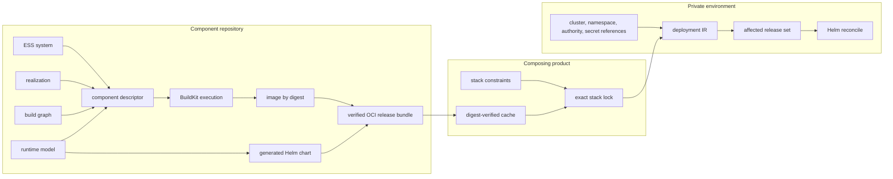

# Independent component delivery

A deployable component belongs to the repository that implements it. Its `ess-component/1`
descriptor points at the semantic system, physical realization, build graph, and runtime model in
that repository, and names separate runtime and chart release units. A composing product owns only
constraints on those releases. The target environment owns only concrete bindings.

This keeps the release graph loosely coupled without making it implicit:

The OCI bundle is the cache and transport boundary. It contains canonical component, build,
runtime, and executor-produced release manifests; it contains neither credentials nor deployment
configuration. Consumers fetch it by manifest digest and verify the SHA-256 of the original
manifest bytes before interpreting them. Each referenced blob must then match its descriptor's
exact size and SHA-256. Bundle payloads also pass the existing model and canonical JSON checks.

The cache accepts two finite OCI image-manifest profiles: an ESS release bundle with the empty
JSON config and one bundle JSON layer, or a Helm config with one chart layer and optional
provenance. Helm provenance and config are checked as opaque bytes; this establishes neither a
signature nor publisher authorization. Unsupported fields, duplicate JSON keys, ambiguous layers,
indexes, descriptor URLs and embedded payload data outside the bundle's fixed empty config are
refused. Annotation titles are inert and never select a filename or fetch location.

Cold acquisition uses explicit ORAS manifest and blob fetches against the pinned repository.
Local limits are 1 MiB for the manifest, config and provenance, 32 MiB for a bundle, and 64 MiB for
a chart, with one 60-second acquisition deadline. A timed-out owned client is killed and reaped.
These are ESS admission limits; they do not impose a hard disk quota on ORAS.

A complete proof entry retains the original manifest and every referenced blob. Every cache hit
repeats the checks and can work with ORAS unavailable. Earlier cache layouts cause cold
acquisition; corrupt proof entries refuse without replacement or automatic repair. Concurrent
writers publish one complete entry without replacing an existing winner. Unpublished staging
files are never cache hits. This protects against process interruption and does not promise
power-loss durability or cache garbage collection.

Helm receives a private snapshot of the verified chart that lives through the executor call.
Replacing a shared cache entry after admission cannot change that snapshot. Desired and current
plans validate before any acquisition or execution. Reconciliation remains sequential: a failed
chart stops its release and later work, while earlier completed releases remain applied.

`ess generate build execute`, `ess generate release publish`, `ess generate release fetch`, and
`ess generate deployment reconcile` are explicit executor commands. They are the only parts of
this flow that invoke BuildKit, ORAS, Helm, or a cluster. The compiler APIs remain deterministic
and offline. Reconciliation compares desired deployment IR with the last applied IR, follows the
declared rollout DAG, and touches only added or changed releases. Removal is a separate reviewed
operation; it is refused unless explicitly enabled.

Runtime models expose named endpoints and persistent volumes. ESS therefore generates the Service,
stateful controller, claims, and mounts once for every adopter. When a required endpoint names a
provided endpoint of another locked component—or a typed external-system endpoint—the environment
compiler derives the URL. A private environment can still override it explicitly.

Configuration-neutral generated charts set the service account to `default`, satisfying the
generated values schema and allowing a fresh chart to pass `helm lint` before a private environment
supplies its own binding.
