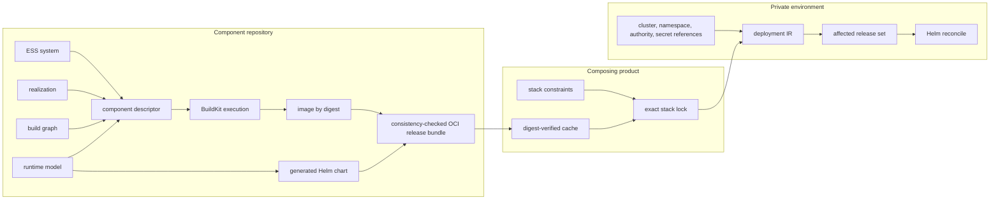

# Independent component delivery

A deployable component belongs to the repository that implements it. Its `ess-component/1`
descriptor points at the semantic system, physical realization, build graph, and runtime model in
that repository, and names separate runtime and chart release units. A composing product owns only
constraints on those releases. The target environment owns only concrete bindings.

This keeps the release graph loosely coupled without making it implicit:



The OCI bundle is the cache and transport boundary. It contains canonical component, build,
runtime, and executor-produced release manifests; it contains neither credentials nor deployment
configuration. Consumers fetch it by manifest digest and verify the SHA-256 of the original
manifest bytes before interpreting them. Each referenced blob must then match its descriptor's
exact size and SHA-256. Bundle payloads also pass the existing model and canonical JSON checks.

The cache accepts two finite OCI image-manifest profiles: an ESS release bundle with the empty
JSON config and one bundle JSON layer, or a Helm config with one chart layer and optional
provenance. Helm provenance and config are checked as opaque bytes; this establishes neither a
signature nor publisher authorization. Unsupported fields, duplicate JSON keys, ambiguous layers,
indexes, descriptor URLs and embedded payload data outside the bundle's fixed empty config are
refused. Annotation titles are inert and never select a filename or fetch location.

Cold acquisition uses explicit ORAS manifest and blob fetches against the pinned repository.
Local limits are 1 MiB for the manifest, config and provenance, 32 MiB for a bundle, and 64 MiB for
a chart, with one 60-second acquisition deadline. A timed-out owned client is killed and reaped.
These are ESS admission limits; they do not impose a hard disk quota on ORAS.

A complete proof entry retains the original manifest and every referenced blob. Every cache hit
repeats the checks and can work with ORAS unavailable. Earlier cache layouts cause cold
acquisition; corrupt proof entries refuse without replacement or automatic repair. Concurrent
writers publish one complete entry without replacing an existing winner. Unpublished staging
files are never cache hits. This protects against process interruption and does not promise
power-loss durability or cache garbage collection.

Helm receives a private snapshot of the verified chart that lives through the executor call.
Replacing a shared cache entry after admission cannot change that snapshot. Desired and current
plans validate before any acquisition or execution. Reconciliation remains sequential: a failed
chart stops its release and later work, while earlier completed releases remain applied.

`ess generate build execute`, `ess generate release publish`, `ess generate release publish-conformance`, `ess generate release fetch`, and
`ess generate deployment reconcile` are explicit executor commands. They are the only parts of
this flow that invoke BuildKit, ORAS, Helm, or a cluster. The compiler APIs remain deterministic
and offline. Reconciliation compares the desired deployment IR with an *admitted baseline desired
deployment* — a document the caller supplies, which says what was requested and is not proof that
it was ever applied — follows the declared rollout DAG, and touches only added or changed
releases. Removal is a separate reviewed operation; it is refused unless explicitly enabled.

`--authority` names one entry of a protected recovery registry the caller provisions, and execution
requires it: without an admitted authority `reconcile` refuses before any external call, cache write
or recovery write. Under one, reconciliation runs the finite recovery contract: it attempts at most
one admitted mutation per
release, records what it can establish before attempting the next one, and stops at the first thing
it cannot. Stopping leaves the affected release's state **unknown** — not absent, not rolled back
and not reconciled — and a later invocation observes and decides again rather than replaying a
remembered list of commands. ESS issues no compensating calls for releases that already succeeded.

Runtime models expose named endpoints and persistent volumes. ESS therefore generates the Service,
stateful controller, claims, and mounts once for every adopter. When a required endpoint names a
provided endpoint of another locked component—or a typed external-system endpoint—the environment
compiler derives the URL. A private environment can still override it explicitly.

Configuration-neutral generated charts set the service account to `default`, satisfying the
generated values schema and allowing a fresh chart to pass `helm lint` before a private environment
supplies its own binding.

## What release evidence establishes

`release verify`, `bundle`, `verify-bundle` and plain `publish` check metadata, graph and digest
consistency. Fetch additionally checks OCI manifest, descriptor and blob content identity. The
four required evidence entries are declared attachments. Provenance is not verified SLSA; SBOM
content and completeness are unverified; signature verification and issuer/trust-root policy are
unsupported. A legacy conformance log is not a typed report.

Every successful route retains these limits: **attachment binding: unverified**;
**producer origin: unverified**; **artifact execution: unverified**;
**signature verification: unsupported**. A successful signing tool does not change these consumer
guarantees. An internally consistent artifact digest, even one supplied beside a passing report,
does not prove that the image or chart ran.

The offline `release check-conformance` command requires an original standalone report/2, an
explicit authored model, canonical component/build/runtime IR, and exactly one independently
supplied original unfiltered suite/5 or input/1 carrier with its complete original parent chain.
The existing readers check exact suite bytes, model and contract digests, selection, inventory,
producer outcome vocabulary, counts and membership. Only a nonempty complete all-pass selection
qualifies. Narrow component, origin or explicit-ID selections qualify for themselves. Empty,
unknown, refused, failed and inconclusive selections cannot satisfy this positive gate. Report/1
remains readable on old routes and always refuses this new gate.

The caller chooses the expected selection independently of the report. ESS checks equality to the
supplied selection; it cannot prove who approved it or authenticate the producer's claim to have
enumerated the inventory. A delivery component label is not inferred to be a modeled component.
Release SemVer remains separate from the model's semantic `vN`.

`release publish-conformance` performs that qualification and stages the exact admitted original
report bytes in the same process for ORAS. Qualified bundle `publish` similarly stages the same
admitted canonical bundle it checked. An optional `--report-sha256` pins raw report bytes and
`--expected-input-sha256` pins the complete supplied suite/carrier file. These local hashes are
distinct from **Evidence.digest**, which remains the OCI attachment manifest digest returned by
publication. ESS checks that returned digest's syntax; it does not reconstruct a remote attachment
proof or authenticate the external tool.

## Migrate the release-component action

The action input contract is breaking. Update both the action revision and the pinned ESS revision
to revisions containing these interfaces, then supply:

```yaml
with:
  spec-path: ess/model
  conformance-report: evidence/report.json
  conformance-suite-input: policy/expected-input.json
```

Use `conformance-suite` instead for an original unfiltered suite/5; exactly one expected-input
variant is required. Produce the report in a prior step. `check-command` is still a generic
repository check; its `target/release/check.log` is not uploaded as conformance, even when the
command exits zero or prints JSON. There is no report fallback, allow-failed option or legacy bypass.

The action snapshots report and expected-input bytes before its generic check, pins those bytes,
and qualifies them against the model and deployment context before build or adoption work. It
rechecks before any evidence upload, uploads conformance through the typed same-process command,
and supplies qualification inputs again for final bundle publication. A later refusal stops later
uploads; earlier image, chart or evidence uploads may remain. No rollback guarantee is implied.

| Action / ESS pairing | Behavior |
|---|---|
| New action / ESS with these commands | Required local report qualification and conservative attachment claims. |
| New action / older ESS | Missing command fails before generic check or release work; no downgrade. |
| Older action / newer ESS | Old declared check logs remain possible; the action does not acquire the new qualification guarantee. |

The adoption review found no callers in its bounded local and organization searches. That is a
no-known-caller result, not proof that private, wrapped or future callers do not exist. No future
release tag is assumed by this migration.
