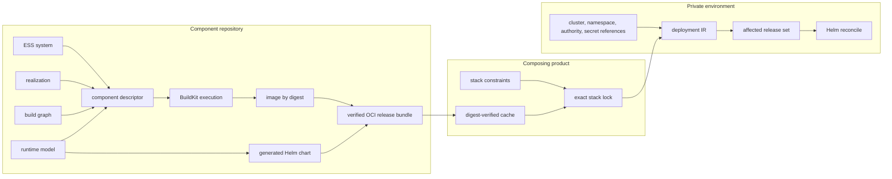

# Independent component delivery

A deployable component belongs to the repository that implements it. Its `ess-component/1`
descriptor points at the semantic system, physical realization, build graph, and runtime model in
that repository, and names separate runtime and chart release units. A composing product owns only
constraints on those releases. The target environment owns only concrete bindings.

This keeps the release graph loosely coupled without making it implicit:

The OCI bundle is the cache and transport boundary. It contains canonical component, build,
runtime, and executor-produced release manifests; it contains neither credentials nor deployment
configuration. Consumers fetch it by manifest digest, verify the complete chain again, and admit
only canonical bytes to their content-addressed cache.

`ess build execute`, `ess release publish`, `ess release fetch`, and
`ess deployment reconcile` are explicit executor commands. They are the only parts of this flow
that invoke BuildKit, ORAS, Helm, or a cluster. The compiler APIs remain deterministic and offline.
Reconciliation compares desired deployment IR with the last applied IR, follows the declared
rollout DAG, and touches only added or changed releases. Removal is a separate reviewed operation;
it is refused unless explicitly enabled.

Runtime models expose named endpoints and persistent volumes. ESS therefore generates the Service,
stateful controller, claims, and mounts once for every adopter. When a required endpoint names a
provided endpoint of another locked component—or a typed external-system endpoint—the environment
compiler derives the URL. A private environment can still override it explicitly.

