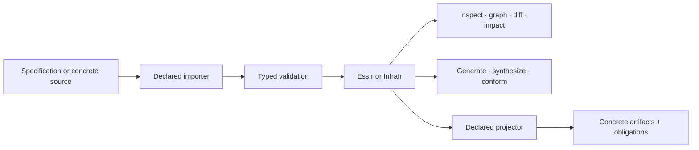

# Architecture overview

ESS keeps system semantics and external authority on different sides of an explicit boundary.

## Pure model and compiler

The domain, compiler, generator, synthesis, conformance, and infrastructure-analysis crates are
value-in/value-out. Persisted collections are ordered, references become compiler-minted handles,
and resolved lookups are total. The same validated input produces the same serialized output.

`EssIr` and `InfraIr` remain separate because application semantics and observed infrastructure
have not demonstrated a required shared envelope. Co-location is not treated as proof that their
identity or reference rules are the same.

## Adapter contract

An importer returns typed IR together with coverage, diagnostics, and unresolved references. It does
not infer semantics absent from its source. A projector returns artifacts, obligations, and explicit
refusals. It never applies those artifacts.

The first bidirectional boundaries are:

| Source direction | Projection direction |
|---|---|
| OpenAPI → supported service, operation, and interface structures | ESS service/interface structures → OpenAPI |
| sanitized Kubernetes observation → infrastructure IR | infrastructure intent → Kubernetes manifests |

Semantic round trips cover only the constructs each adapter declares. Target formatting may be
normalized.

## Kubernetes credential edge

Live Kubernetes access exists only in the named adapter. It reads caller-selected authority and
sanitizes observations before typed IR crosses into downstream crates. Raw Secret `data`,
`stringData`, and last-applied configuration never reach serialized output or disk. Live-cluster
tests are opt-in and stay outside the offline repository gate.
