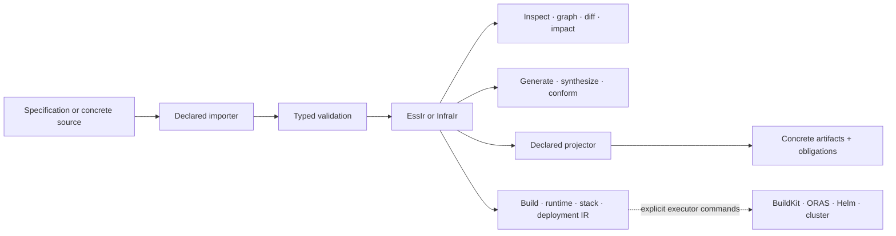

# Architecture overview

```mermaid
flowchart LR
  Source[Specification or concrete source] --> Adapter[Declared importer]
  Adapter --> Validate[Typed validation]
  Validate --> IR[EssIr or InfraIr]
  IR --> Analyze[Inspect · graph · diff · impact]
  IR --> Generate[Generate · synthesize · conform]
  IR --> Project[Declared projector]
  Project --> Artifact[Concrete artifacts + obligations]
  IR --> Deliver[Build · runtime · stack · deployment IR]
  Deliver -. explicit executor commands .-> External[BuildKit · ORAS · Helm · cluster]
```

## The four command areas

| Area | What it does | Guides |
|---|---|---|
| `ess specify` | validate and compile a specification, inspect and graph it, compose component surfaces into clients, compile realizations, runtime models and CLI presentations, manage the `ess` toolchain pin | [Write a specification](../guides/write-a-specification.md), [Record a physical realization](../guides/record-realization.md) |
| `ess generate` | documentation, schemas, OpenAPI and AsyncAPI; structural code; build, component, release, stack and deployment documents; projections to BuildKit, Helm, Kubernetes and OpenAPI | [Generate contracts and documentation](../guides/generate-artifacts.md), [Synthesize code](../guides/synthesize.md), [Project a build and a Helm chart](../guides/deliver/build-and-chart.md) |
| `ess verify` | conformance suites and runs, mutation audits, history checks, semantic diff and impact, binding checks | [Verify conformance](../guides/verify-conformance.md), [Track specification change](../guides/track-change.md) |
| `ess infra` | import an observed cluster or an OpenAPI document, then diagnose, graph and compare infrastructure IR | [Import and project Kubernetes infrastructure](../guides/check-infrastructure.md) |

## Pure model and compiler

The domain, compiler, generator, synthesis, conformance, deployment-model and
infrastructure-analysis libraries are value-in, value-out. Persisted collections are ordered,
references become compiler-minted handles, and resolved lookups are total. The same validated input
produces the same serialized output.

`EssIr` and `InfraIr` remain separate because application semantics and observed infrastructure
have not demonstrated a required shared envelope. Co-location is not treated as proof that their
identity or reference rules are the same.

## Adapter contract

An importer returns typed IR together with coverage, diagnostics, and unresolved references. It does
not infer semantics absent from its source. A projector returns artifacts, obligations, and explicit
refusals. It never applies those artifacts.

| Source direction | Projection direction |
|---|---|
| OpenAPI 3.0/3.1 → supported service, operation and interface structures | ESS service/interface structures → OpenAPI |
| sanitized Kubernetes observation → infrastructure IR | infrastructure intent → Kubernetes manifests |
| adopter-owned JSON Schema registry → checked schema bundle | schema bundle → TypeScript types |
| — | build IR → BuildKit inputs; runtime IR → Helm chart |

Semantic round trips cover only the constructs each adapter declares. Target formatting may be
normalized. There is no AsyncAPI importer; AsyncAPI is a projection only.

## Delivery documents

A component's build graph, runtime model, releases, a product's stack and an environment's
deployment are typed documents too. Compiling, resolving and comparing them is offline and
deterministic: `build compile`, `specify runtime compile`, `release verify`, `stack resolve`,
`deployment compile` and `deployment diff` read files and write files.
[Independent component delivery](./component-delivery.md) describes the chain.

## The executor edge

These commands call external tools, and only when you run them:

| Command | Calls |
|---|---|
| `ess generate build execute` | Docker Buildx Bake |
| `ess generate release publish`, `publish-conformance`, `fetch` | ORAS |
| `ess generate deployment reconcile` (without `--dry-run`) | ORAS, the Kubernetes API and Helm, under a provisioned recovery authority |
| `ess infra import kubernetes --context` | the Kubernetes API, read-only |

They do not make ESS a running control plane: each is one finite invocation that reports what it
established and stops.

## Kubernetes credential edge

Live Kubernetes access exists only in the `ess-kubernetes` adapter, which live import and
`deployment reconcile`'s observation both use. It reads the caller-selected authority and
sanitizes observations before typed IR crosses into other libraries. Raw Secret `data`,
`stringData`, and last-applied configuration never reach serialized output or disk. Live-cluster
tests are opt-in and stay outside the offline repository gate.
