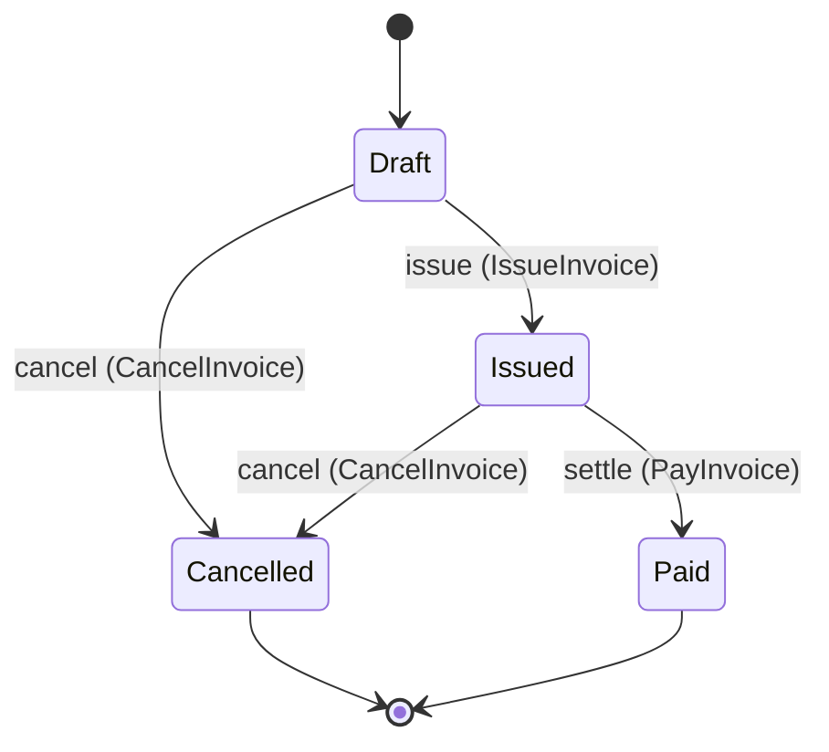

# A specification and its contracts

This page shows the central claim on real files: the specification is not a document *beside* the
contracts — it is what the contracts are derived from. Everything below is copied out of the
repository: the source from `examples/billing/`, the output from `generated/`, kept in step by
`cargo xtask generate --check` in CI.

The excerpts are the files on `main`. Each code block names the file it was copied from, and a test
compares every block with that file, so a regenerated artifact this page was not updated for fails
the build. Entity relations and the account field visible in the billing example shipped in
`0.5.0`.

## The source

**[See this specification drawn](https://beyond10x.github.io/ess/docs/visualise)** — the
invoicing domain as the compiler resolves it, and the conformance run it obliges, both recorded
from the real `ess` binary.

One command, from `examples/billing/domains/invoice.yaml`:

```yaml file=examples/billing/domains/invoice.yaml lines=191-259
commands:
  - name: billing.invoice.CreateInvoice

    naming:
      wire: create-invoice
      display: Create invoice

    input:
      - name: account_id
        type: billing.invoice.AccountId
      - name: customer_email
        type: billing.invoice.Email
      - name: amount
        type: billing.invoice.Money

    # Two outcomes, because this command can be refused. A specification that recorded only the
    # first would generate a suite that never checks what happens when the amount is wrong.
    #
    # The subject hangs off the *outcome*, not off the command: `accepted` brings an invoice into
    # existence and `rejected` brings nothing into existence, and a subject on the command would have
    # attached a state change to the refusal. `creates:` is not a transition — a new instance has no
    # state to move out of — so it starts at the lifecycle's `initial`.
    outcomes:
      - name: accepted
        when: amount.amount > 0
        creates: billing.invoice.Invoice
        # Which invoice. `creates:` is the one verb whose instance the caller cannot name — the
        # invoice does not exist when the command is issued and its id is the implementation's to
        # assign — so `instance:` names the field of an *emitted* event the new identity is
        # published in. That is what lets the next scenario say "the invoice the previous step
        # created" instead of inventing one.
        instance: invoice_id
        emits:
          - billing.invoice.InvoiceCreated
        # Where the announced fact's fields come from. Without this block the event's *types* are
        # declared and its *values* are not, so an implementation announcing an amount nobody
        # submitted contradicts nothing — the one fault the conformance matrix recorded as caught
        # by nothing. `invoice_id` has no line here on purpose: the identity is the
        # implementation's to assign, so it stays undetermined and a suite asserts its presence
        # and type, never its value.
        payload:
          billing.invoice.InvoiceCreated:
            account_id: input.account_id
            customer_email: input.customer_email
            amount: input.amount
        # The same relation, pointed at the invoice instead of the announcement. `payload:` says
        # what the event carries; this says what the *invoice* holds, which is what every view of
        # it later shows. Without it a generated scenario can find the row it created and say
        # nothing about what is in it, so an implementation that stored somebody else's amount
        # passes — the ordering half of the same gap is why `OutstandingInvoices` could be asserted
        # to be in order and never to be in the right order.
        #
        # `invoice_id` has no line here for the reason it has none above: the identity is the
        # implementation's to assign. `issued_at` has none because `CreateInvoice` is not what
        # sets it: a draft has not been issued, and `IssueInvoice` below is what records the
        # instant.
        #
        # `reminder_count` starts at zero, and says so, because the invariant `reminder_count >= 0`
        # reads it: a required field no creating branch sets holds whatever the implementation
        # picked, and the invariant would then hold or fail on that choice (ess#112).
        sets:
          account_id: input.account_id
          total: input.amount
          reminder_count: "0"
        summary: The invoice is created in Draft.

      - name: rejected
        error: billing.invoice.InvalidAmount
        summary: The amount was not positive, and nothing was created.
```

`Money` and `Email` are declared in the same file — `Money` a struct with the invariant
`amount >= 0`, `Email` a newtype over `String` that is deliberately not interchangeable with one.

## JSON Schema

`generated/schema/commands/billing.invoice.CreateInvoice.schema.json`, in full:

```json file=generated/schema/commands/billing.invoice.CreateInvoice.schema.json
{
  "$schema": "https://json-schema.org/draft/2020-12/schema",
  "title": "Create invoice input",
  "x-ess-name": "billing.invoice.CreateInvoice",
  "x-ess-kind": "command-input",
  "type": "object",
  "properties": {
    "account_id": {
      "$ref": "#/$defs/billing.invoice.AccountId"
    },
    "customer_email": {
      "$ref": "#/$defs/billing.invoice.Email"
    },
    "amount": {
      "$ref": "#/$defs/billing.invoice.Money"
    }
  },
  "required": [
    "account_id",
    "customer_email",
    "amount"
  ],
  "additionalProperties": false,
  "x-ess-provenance": {
    "system": "billing",
    "specification_version": "v3",
    "source_digest": "096efa38ec46e97a32f81b72193e43114df1156464648a885134ffafc9ac9648",
    "contract_digest": "slice-sha256/2:79a52ac939c2e51d1a43759c926d7366c3f4cbae003a2993d8f93a23b103f004",
    "regenerate": "ess generate"
  },
  "$defs": {
    "billing.invoice.AccountId": {
      "title": "AccountId",
      "x-ess-name": "billing.invoice.AccountId",
      "x-ess-kind": "newtype",
      "type": "string",
      "format": "uuid",
      "pattern": "^[0-9a-fA-F]{8}-[0-9a-fA-F]{4}-[0-9a-fA-F]{4}-[0-9a-fA-F]{4}-[0-9a-fA-F]{12}$"
    },
    "billing.invoice.Email": {
      "title": "Email",
      "x-ess-name": "billing.invoice.Email",
      "x-ess-kind": "newtype",
      "type": "string"
    },
    "billing.invoice.Money": {
      "title": "Money",
      "x-ess-name": "billing.invoice.Money",
      "x-ess-kind": "struct",
      "type": "object",
      "properties": {
        "amount": {
          "type": "string",
          "format": "decimal",
          "pattern": "^-?(0|[1-9][0-9]*)(\\.[0-9]+)?$"
        },
        "currency": {
          "type": "string"
        }
      },
      "required": [
        "amount",
        "currency"
      ],
      "additionalProperties": false,
      "x-ess-invariants": [
        "amount >= 0"
      ]
    }
  }
}
```

Three things to notice. The newtype survived as its own definition rather than collapsing into
`string`. The struct's invariant travelled with it as `x-ess-invariants`. And the provenance block
carries two digests, not one: `source_digest` is the whole model this file was generated from, and
`contract_digest` is the digest of the *slice* it actually derives from — the seed constructs closed
over everything they rest on.

The second digest is what stops a one-word change costing a full regeneration. When the
specification moves, `ess verify impact` compares each artifact's committed `contract_digest`
against the digest its slice computes, and names only the artifacts whose slice actually moved.
Without it, every change owes the whole generated tree.

## OpenAPI 3.1

`generated/openapi/invoice-service.yaml`, the path for the same command:

```yaml file=generated/openapi/invoice-service.yaml lines=66-93
  /invoices/commands/create-invoice:
    post:
      operationId: billing.invoice.CreateInvoice
      summary: Create invoice
      tags:
      - invoices
      x-ess-may-invoke:
      - billing.invoice.Customer
      requestBody:
        description: The input `billing.invoice.CreateInvoice` declares.
        required: true
        content:
          application/json:
            schema:
              $ref: '#/components/schemas/billing.invoice.CreateInvoice.Input'
      responses:
        '202':
          description: 'Outcome `accepted`: the branch the specification declares for this input. Events this branch emits are published to consumers and listed under `published`.'
          content:
            application/json:
              schema:
                $ref: '#/components/schemas/billing.invoice.CreateInvoice.accepted.Response'
        '422':
          description: 'Outcome `rejected`: the request was understood and refused on domain grounds. The body names the declared error and carries whatever that error declares.'
          content:
            application/json:
              schema:
                $ref: '#/components/schemas/billing.invoice.CreateInvoice.rejected.Response'
```

The two outcomes became two status codes, and `x-ess-may-invoke` comes from the actor declaration in
the model — not from an annotation someone added to the HTTP layer. The file's own header records
the provenance and the regeneration command.

## AsyncAPI 3.0

`generated/asyncapi/invoice-service.yaml` describes what the component publishes, and says plainly
what the model does not know:

```text file=generated/asyncapi/invoice-service.yaml lines=16-16
    The specification declares no transport, so each address below is a name and not a topic on a named broker. Servers, protocol bindings, security schemes, message keys, partitioning, retention and ordering are absent because the model does not state them.
```

A generator that invented a broker here would be inventing a decision nobody made.

## Documentation

`generated/docs/domains/billing-invoice.md` renders the entity lifecycle from the declared
transitions:



Then it does something a diagram cannot: it lists the absences. Illegal transitions are illegal
because no arrow exists — there is no second, forbidding rule to fall out of date — and since a
diagram cannot show an absence, the unconnected pairs are listed, derived from the same transitions:

```markdown file=generated/docs/domains/billing-invoice.md lines=146-153
- `Cancelled` may not become `Draft`
- `Cancelled` may not become `Issued`
- `Cancelled` may not become `Paid`
- `Draft` may not become `Paid`
- `Issued` may not become `Draft`
- `Paid` may not become `Cancelled`
- `Paid` may not become `Draft`
- `Paid` may not become `Issued`
```

The same page renders the cross-context binding as a flowchart — the event, the command it invokes,
its outcomes, and the escalation event that makes the failure path observable at all.

## Static site

`ess generate --kind site` renders the same pages as a browsable HTML site: `index.html`, one page
per domain, the interaction and topology pages, and a local stylesheet and diagram renderer. Every
page opens with the same provenance as the Markdown:

```html file=generated/site/index.html lines=2-7
<!--
  generated from billing v3
  model digest 096efa38ec46e97a32f81b72193e43114df1156464648a885134ffafc9ac9648
  contract digest c9ecfdf5bed1bcb88068dad060895f16ca73de361204ae488d6f0d39477f6f79
  do not edit: regenerate with `ess generate`
-->
```

The committed pages are under `generated/site/`. ESS writes the files; hosting them is up to you.

It is also not a reverse parser. The ESS YAML above is the specification; the prose in the generated
page is one projection. Editing that prose cannot change the model, and regenerating replaces it.

## What is not generated

Behaviour. The specification also generates its own conformance suite and the structural part of its
implementation in four targets — but every algorithm remains a typed obligation someone implements.
See [Synthesize code from a specification](../guides/synthesize.md) and
[Limitations](../status/limitations.md).

---

**Sources.** `examples/billing/domains/invoice.yaml`;
`generated/schema/commands/billing.invoice.CreateInvoice.schema.json`;
`generated/openapi/invoice-service.yaml`; `generated/asyncapi/invoice-service.yaml`;
`generated/docs/domains/billing-invoice.md`; `generated/site/index.html`;
`Taskfile.yml` (`projection-check`, which holds the generated files and the recorded `ess`
sessions to a fresh run).
